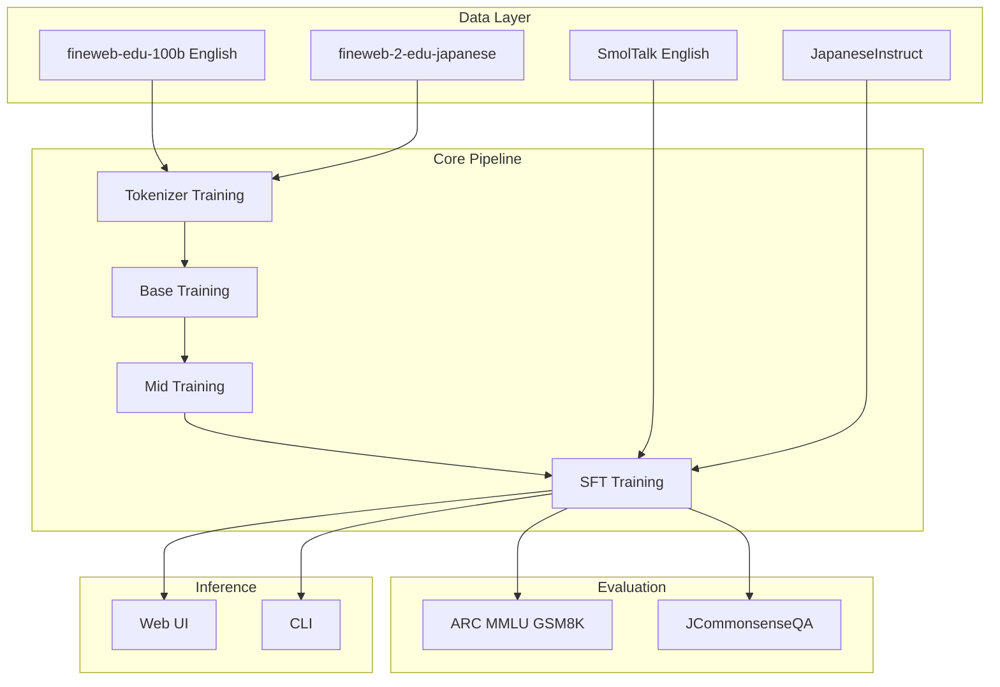
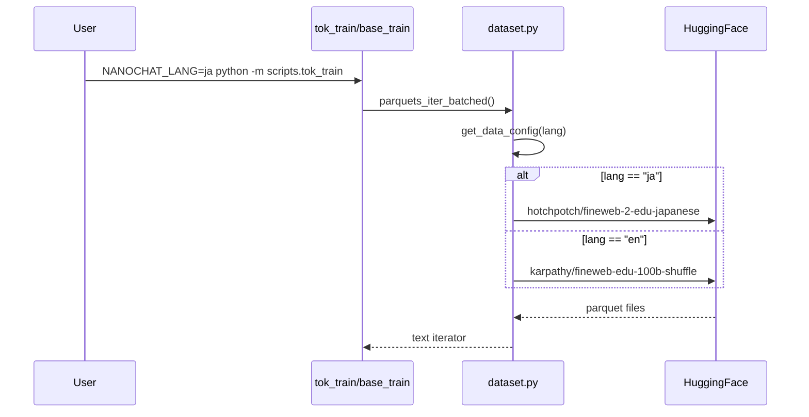

# Design Document: japanese-support

## Overview

**Purpose**: nanochat に日本語テキストの学習・推論能力を追加し、日本語での対話が可能な ChatGPT クローンを実現する。

**Users**: 日本語で LLM を学習・評価したい開発者、日本語で nanochat と対話したいユーザー。

**Impact**: 既存の英語専用パイプラインを多言語対応に拡張。トークナイザ、データセット、SFT、評価の各段階で日本語を処理可能にする。

### Goals
- 日本語テキストを効率的にトークナイズし学習に使用できる
- 日本語会話データで SFT を実行できる
- JCommonsenseQA で日本語能力を定量評価できる
- Web UI で日本語の入出力ができる

### Non-Goals
- 日本語専用の最適化された SPLIT_PATTERN の開発 (将来検討)
- JGLUE の全タスク対応 (JCommonsenseQA のみ)
- 日英同時学習の最適化 (単一言語学習を優先)

---

## Architecture

### Existing Architecture Analysis

現在の nanochat アーキテクチャ:

```
[データ取得] → [トークナイザ学習] → [事前学習] → [中間学習] → [SFT] → [評価] → [推論/Web UI]
```

**既存の制約**:
- `dataset.py`: `BASE_URL` が英語 fineweb-edu に固定
- `tasks/`: 英語ベンチマークのみ (ARC, MMLU, GSM8K)
- トークナイザ: Unicode 対応済み (変更不要)
- Web UI: UTF-8/ストリーミング対応済み (変更不要)

### Architecture Pattern & Boundary Map



**Architecture Integration**:
- Selected pattern: **Hybrid Extension** - 既存コンポーネント拡張 + 新規タスクファイル
- Domain boundaries: データソース層 (言語別) / パイプライン層 (言語非依存) / 評価層 (言語別)
- Existing patterns preserved: Task クラス継承、HuggingFace datasets 経由のデータ取得
- New components rationale: 日本語固有のデータ形式変換と評価ロジックを分離
- Steering compliance: ミニマル・ハッカブル原則を維持、設定オブジェクトの肥大化回避

### Technology Stack

| Layer | Choice / Version | Role in Feature | Notes |
|-------|------------------|-----------------|-------|
| Data | HuggingFace datasets | 日本語データセット取得 | fineweb-2-edu-japanese, JGLUE, izumi-lab |
| Backend | Python 3.10+ | データ処理・学習スクリプト | 既存と同一 |
| Tokenizer | RustBPE + tiktoken | 日本語 BPE 学習・推論 | Unicode 対応済み |
| Infrastructure | 環境変数 | 言語切り替え | `NANOCHAT_LANG` |

---

## System Flows

### 日本語データセット切り替えフロー



---

## Requirements Traceability

| Requirement | Summary | Components | Interfaces | Flows |
|-------------|---------|------------|------------|-------|
| 1.1, 1.3, 1.4 | 日本語 BPE 学習 | RustBPE, tokenizer.py | (変更不要) | - |
| 1.2 | 日本語圧縮率評価 | tok_eval.py | - | - |
| 2.1, 2.2, 2.3 | 日本語学習データ | dataset.py | DataConfig | データ切り替えフロー |
| 3.1, 3.2, 3.3 | 日本語 SFT | JapaneseInstruct | Task | - |
| 4.1, 4.2, 4.3, 4.4 | 日本語 Web UI | chat_web.py | (変更不要) | - |
| 5.1, 5.2, 5.3 | 日本語評価 | JCommonsenseQA | Task, chat_eval | - |

---

## Components and Interfaces

| Component | Domain/Layer | Intent | Req Coverage | Key Dependencies | Contracts |
|-----------|--------------|--------|--------------|------------------|-----------|
| dataset.py | Data | 言語別データソース切り替え | 2.1, 2.2, 2.3 | HuggingFace (P0) | Config |
| tok_eval.py | Evaluation | 日本語圧縮率評価 | 1.2 | tokenizer (P0) | - |
| JapaneseInstruct | Tasks | 日本語 SFT データ | 3.1, 3.2, 3.3 | datasets (P0) | Task |
| JCommonsenseQA | Tasks | 日本語常識推論評価 | 5.1, 5.2, 5.3 | datasets (P0) | Task |

---

### Data Layer

#### dataset.py (Extension)

| Field | Detail |
|-------|--------|
| Intent | 環境変数/引数で日本語データソースに切り替え可能にする |
| Requirements | 2.1, 2.2, 2.3 |

**Responsibilities & Constraints**
- 言語設定に基づき適切なデータソース URL を返す
- 既存の parquet 形式との互換性維持
- 環境変数 `NANOCHAT_LANG` または関数引数で言語指定

**Dependencies**
- Outbound: HuggingFace datasets — データ取得 (P0)

**Contracts**: Config [ x ]

##### Config Interface
```python
@dataclass
class DataConfig:
    base_url: str
    max_shard: int
    text_column: str  # parquet 内のテキストカラム名

def get_data_config(lang: str = "en") -> DataConfig:
    """言語に応じたデータ設定を返す"""
    ...
```

**Implementation Notes**
- 環境変数 `NANOCHAT_LANG` をデフォルト値として使用
- `text_column` は fineweb 系では `"text"` で統一されているが、将来の拡張に備えて設定化

---

### Tasks Layer

#### JapaneseInstruct

| Field | Detail |
|-------|--------|
| Intent | izumi-lab/llm-japanese-dataset を SmolTalk 形式に変換して提供 |
| Requirements | 3.1, 3.2, 3.3 |

**Responsibilities & Constraints**
- `instruction/input/output` 形式を `messages` 形式に変換
- Task 基底クラスを継承し、既存パイプラインと互換
- start/stop/step によるスライシング対応

**Dependencies**
- External: izumi-lab/llm-japanese-dataset — 9M+ 例 (P0)
- Inbound: tokenizer.render_conversation — トークナイズ (P0)

**Contracts**: Task [ x ]

##### Task Interface
```python
class JapaneseInstruct(Task):
    def __init__(self, split: str = "train", **kwargs):
        """
        Args:
            split: "train" のみ (データセットに val/test なし)
        """
        ...

    def num_examples(self) -> int:
        """データセット内の例数を返す"""
        ...

    def get_example(self, index: int) -> dict:
        """
        Returns:
            {
                "messages": [
                    {"role": "user", "content": instruction + input},
                    {"role": "assistant", "content": output}
                ]
            }
        """
        ...
```

**Implementation Notes**
- `input` が空でない場合は `instruction` と連結 (`\n\n` 区切り)
- ライセンス: CC-BY-SA 4.0 (permissive)

---

#### JCommonsenseQA

| Field | Detail |
|-------|--------|
| Intent | JGLUE JCommonsenseQA を評価タスクとして提供 |
| Requirements | 5.1, 5.2, 5.3 |

**Responsibilities & Constraints**
- 5択問題を既存の multiple choice 形式でレンダリング
- `eval_type = "categorical"` で正解判定
- train/val/test スプリット対応

**Dependencies**
- External: shunk031/JGLUE JCommonsenseQA — train 8,939 / val 1,119 (P0)
- Inbound: render_mc — 多肢選択フォーマット (P1)

**Contracts**: Task [ x ]

##### Task Interface
```python
class JCommonsenseQA(Task):
    def __init__(self, split: str = "validation", **kwargs):
        """
        Args:
            split: "train" | "validation" | "test"
        """
        ...

    @property
    def eval_type(self) -> str:
        return "categorical"

    def num_examples(self) -> int:
        ...

    def get_example(self, index: int) -> dict:
        """
        Returns:
            {
                "messages": [
                    {"role": "user", "content": render_mc(question, letters, choices)},
                    {"role": "assistant", "content": correct_letter}
                ]
            }
        """
        ...

    def evaluate(self, problem: dict, completion: str) -> bool:
        """completion が正解レターと一致するか判定"""
        ...
```

**Implementation Notes**
- `choice0` - `choice4` を A-E にマッピング
- `label` (0-4) から正解レターを決定
- 既存 ARC, MMLU の `render_mc` パターンを流用

---

### Evaluation Layer

#### tok_eval.py (Extension)

| Field | Detail |
|-------|--------|
| Intent | 日本語テキストの圧縮率評価を追加 |
| Requirements | 1.2 |

**Responsibilities & Constraints**
- 日本語サンプルテキスト (`japanese_text`) を追加
- 既存の `all_text` リストに追加
- GPT-2/GPT-4/ours の比較表に日本語行を追加

**Implementation Notes**
- 韓国語 (`korean_text`) と同様のパターンで追加
- 日本語ニュース、Wikipedia、技術文書などからサンプル選定

---

## Data Models

### Domain Model

**Conversation (既存)**
```
Conversation
├── messages: List[Message]
│   ├── role: "user" | "assistant" | "system"
│   └── content: str
```

**JCommonsenseQA Example**
```
JCommonsenseQAExample
├── q_id: str
├── question: str
├── choices: List[str]  # 5 choices
├── label: int  # 0-4
└── letters: List[str]  # A-E
```

### Data Contracts & Integration

**izumi-lab データ形式 (入力)**
```json
{
  "instruction": "以下の質問に答えてください。",
  "input": "日本の首都はどこですか？",
  "output": "日本の首都は東京です。"
}
```

**nanochat Conversation 形式 (出力)**
```json
{
  "messages": [
    {"role": "user", "content": "以下の質問に答えてください。\n\n日本の首都はどこですか？"},
    {"role": "assistant", "content": "日本の首都は東京です。"}
  ]
}
```

---

## Error Handling

### Error Categories and Responses

**データ取得エラー**:
- HuggingFace からのダウンロード失敗 → 既存のリトライ機構を使用
- parquet ファイル破損 → スキップしてログ出力

**トークナイズエラー**:
- 未知 Unicode 文字 → `byte_fallback` で自動処理 (エラーなし)

**評価エラー**:
- JCommonsenseQA ロード失敗 → 評価スキップ、レポートに N/A 記録

---

## Testing Strategy

### Unit Tests
- `JapaneseInstruct.get_example()` の形式変換が正しいか
- `JCommonsenseQA.evaluate()` の正解判定が正しいか
- `get_data_config("ja")` が正しい URL を返すか

### Integration Tests
- 日本語データで `tok_train.py` が正常終了するか
- `tok_eval.py` に日本語テキストが含まれ圧縮率が計算されるか
- `chat_sft.py` で JapaneseInstruct を含む TaskMixture が動作するか

### E2E Tests
- 日本語入力 → Web UI → 日本語出力のストリーミングが正常か
- JCommonsenseQA 評価が report.md に記録されるか

---

## Performance & Scalability

**日本語トークナイザ圧縮率**:
- UTF-8 日本語は 3 バイト/文字、英語は 1 バイト/文字
- 日本語データでトークナイザを学習すれば 2-4 文字/トークンの圧縮率が期待できる
- vocab_size 65536 (デフォルト) で十分な日本語カバレッジ

**データセットサイズ**:
- fineweb-2-edu-japanese: 89.3B トークン (英語 100B と同程度)
- izumi-lab: 9M 例 (SmolTalk 10K よりも大幅に多い、サブサンプリング推奨)

---

## Supporting References

詳細な調査結果は `research.md` を参照:
- 日本語データセット比較
- ライセンス確認
- 設計決定の代替案と根拠
