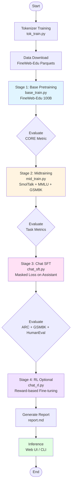
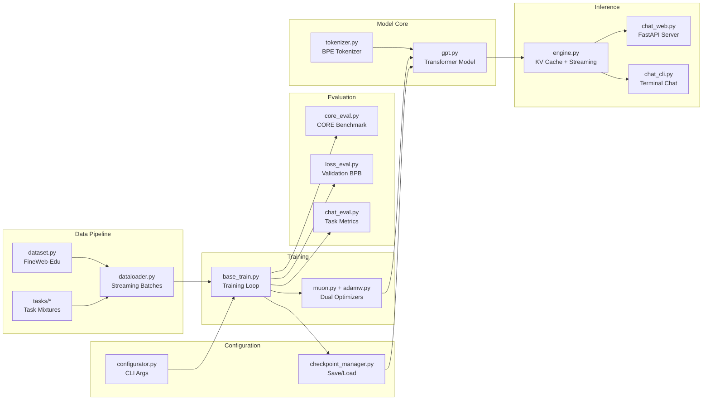
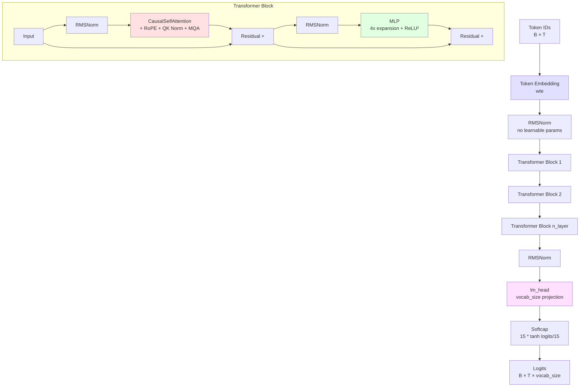
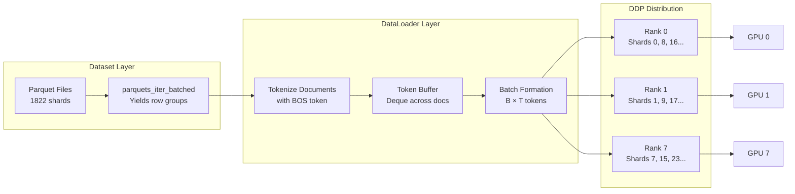
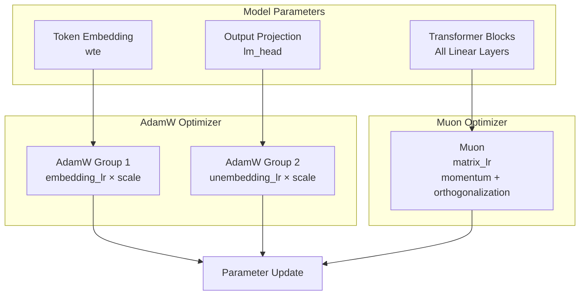
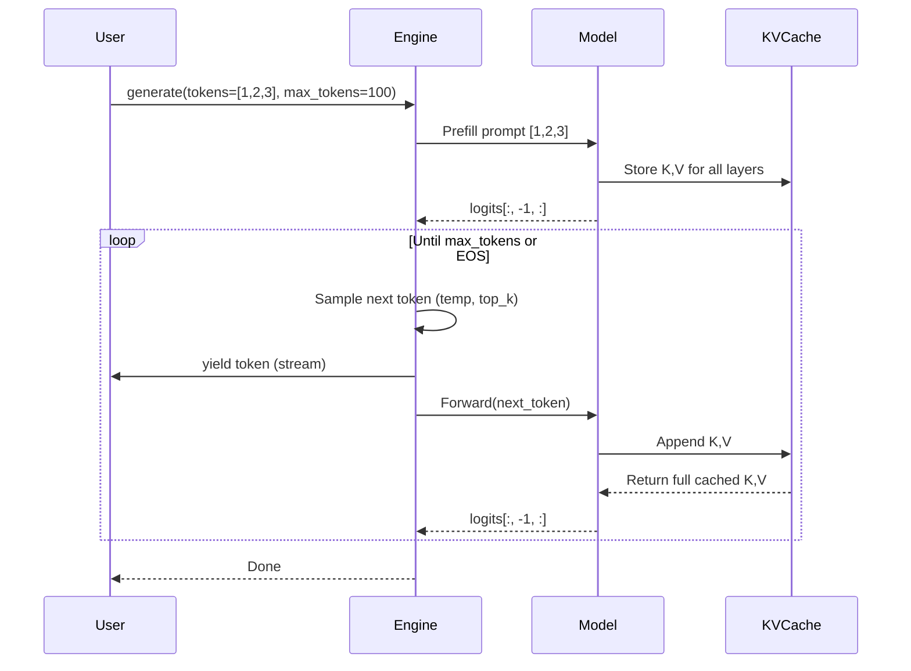
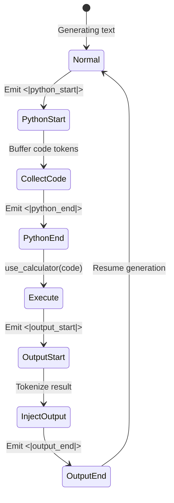

# NanoChat Technical Documentation (auto-generated)

> **The best ChatGPT that $100 can buy**
>
> A complete, minimal, hackable implementation of a ChatGPT-like LLM from tokenization to deployment.

---

## Table of Contents

1. [Introduction & Overview](#1-introduction--overview)
2. [System Architecture](#2-system-architecture)
3. [Tokenization](#3-tokenization)
4. [Model Architecture](#4-model-architecture)
5. [Data Pipeline](#5-data-pipeline)
6. [Training Stages](#6-training-stages)
7. [Optimization](#7-optimization)
8. [Inference & Generation](#8-inference--generation)
9. [Evaluation](#9-evaluation)
10. [Configuration & Extensibility](#10-configuration--extensibility)
11. [Appendices](#11-appendices)

---

## 1. Introduction & Overview

### 1.1 What is NanoChat?

NanoChat is a **full-stack LLM implementation** that trains a ChatGPT-like model from scratch in a single, clean, minimal codebase. Unlike heavyweight frameworks, nanochat prioritizes:

- **Accessibility**: Train complete models for $100-$1000
- **Hackability**: ~8K lines of code across 45 files
- **Minimalism**: Vanilla PyTorch with minimal dependencies
- **Educational**: Designed as a capstone for LLM101n course

### 1.2 Philosophy & Design Principles

1. **No framework bloat** - Direct PyTorch implementation, no abstraction layers
2. **Single-node focused** - Optimized for 8×H100 GPU nodes
3. **End-to-end ownership** - From raw bytes to web UI
4. **Reproducible** - Deterministic training with fixed seeds
5. **Production-grade** - Despite simplicity, includes DDP, checkpointing, evaluation

### 1.3 Quick Reference Stats

| Metric | Value |
|--------|-------|
| **Codebase** | ~8,300 lines, 45 files |
| **Training Time** | 4 hours (d20) to 41 hours (d32) |
| **Cost** | $100 (speedrun) to $1000 (full) |
| **Model Sizes** | 165M (d20) to 1.9B (d32) parameters |
| **Training Data** | 38B tokens (d32) from FineWeb-Edu |
| **Dependencies** | PyTorch, HuggingFace Tokenizers, minimal extras |
| **Vocab Size** | 50,304 tokens (GPT-4 style BPE) |

---

## 2. System Architecture

### 2.1 High-Level Pipeline Flow



### 2.2 Directory Structure

```
nanochat/
├── nanochat/               # Core ML library
│   ├── gpt.py             # Model architecture (GPT, Attention, MLP)
│   ├── tokenizer.py       # BPE tokenizer (Rust + tiktoken)
│   ├── dataloader.py      # Streaming data loader for pretraining
│   ├── dataset.py         # FineWeb-Edu parquet downloader
│   ├── engine.py          # Inference engine with KV cache
│   ├── muon.py            # Muon optimizer implementation
│   ├── adamw.py           # Distributed AdamW
│   ├── core_eval.py       # CORE benchmark evaluation
│   ├── loss_eval.py       # Validation loss (BPB) evaluation
│   ├── checkpoint_manager.py  # Model/optimizer checkpointing
│   ├── configurator.py    # CLI argument parsing
│   └── common.py          # DDP utilities, device detection
├── scripts/               # Training & inference entry points
│   ├── base_train.py      # Stage 1: Pretraining
│   ├── mid_train.py       # Stage 2: Midtraining
│   ├── chat_sft.py        # Stage 3: SFT
│   ├── chat_rl.py         # Stage 4: RL
│   ├── base_eval.py       # Evaluate base models
│   ├── chat_eval.py       # Evaluate chat models
│   ├── chat_web.py        # FastAPI web server
│   └── chat_cli.py        # CLI chat interface
├── tasks/                 # Dataset task implementations
│   ├── common.py          # Base Task class
│   ├── mmlu.py            # Multiple-choice knowledge
│   ├── gsm8k.py           # Math word problems
│   ├── arc.py             # AI2 Reasoning Challenge
│   ├── humaneval.py       # Python code generation
│   ├── smoltalk.py        # General conversations
│   ├── spellingbee.py     # Letter counting tasks
│   └── customjson.py      # Custom JSONL conversations
├── rustbpe/              # Rust BPE tokenizer (fast training)
├── speedrun.sh           # 4-hour $100 training script
├── run1000.sh            # 41-hour $1000 training script
└── README.md
```

### 2.3 Component Interaction



---

## 3. Tokenization

### 3.1 BPE Tokenizer Implementation

NanoChat uses **Byte Pair Encoding (BPE)** with GPT-4 style text splitting. Two implementations are available:

| Implementation | Training | Inference | Speed |
|----------------|----------|-----------|-------|
| **HuggingFaceTokenizer** | ✅ Slow | ✅ Slow | Good for prototyping |
| **RustBPETokenizer** (default) | ✅ Fast (Rust) | ✅ Fast (tiktoken) | Production |

**Split Pattern** (slightly modified from GPT-4):
```regex
'(?i:[sdmt]|ll|ve|re)|[^\r\n\p{L}\p{N}]?+\p{L}+|\p{N}{1,2}| ?[^\s\p{L}\p{N}]++[\r\n]*|\s*[\r\n]|\s+(?!\S)|\s+
```

**Key Difference**: Uses `\p{N}{1,2}` instead of `\p{N}{1,3}` to avoid "wasting" tokens on numbers for smaller vocab sizes.

### 3.2 Special Tokens & Conversation Rendering

**Special Tokens** (9 total):
```python
SPECIAL_TOKENS = [
    "<|bos|>",              # Beginning of sequence (every document)
    "<|user_start|>",       # User message boundary
    "<|user_end|>",
    "<|assistant_start|>",  # Assistant message boundary
    "<|assistant_end|>",
    "<|python_start|>",     # Python tool invocation
    "<|python_end|>",
    "<|output_start|>",     # Tool output (not supervised)
    "<|output_end|>",
]
```

**Conversation Rendering Example**:

```
<|bos|><|user_start|>What is 2+2?<|user_end|><|assistant_start|>Let me calculate that: <|python_start|>2+2<|python_end|><|output_start|>4<|output_end|> The answer is 4.<|assistant_end|>
```

**Supervision Mask**: During SFT, only tokens within `<|assistant_start|>...<|assistant_end|>` are supervised (loss is masked for user/tool output).

### 3.3 Training the Tokenizer

**File**: `scripts/tok_train.py`

```bash
python -m scripts.tok_train --vocab_size=50304
```

- Trains on 500M characters from FineWeb-Edu
- Uses `rustbpe` for fast training
- Outputs to `tokenizer/` directory
- Vocab size padded to nearest multiple of 64 for GPU efficiency

**Vocabulary Size Calculation**:
```python
vocab_size = 50304  # 256 (bytes) + 50000 (merges) + 9 (special tokens) + padding
```

---

## 4. Model Architecture

### 4.1 Transformer Design



### 4.2 GPTConfig & Hyperparameters

```python
@dataclass
class GPTConfig:
    sequence_len: int = 1024      # Max context length
    vocab_size: int = 50304       # Vocabulary size
    n_layer: int = 12             # Number of transformer blocks
    n_head: int = 6               # Number of query heads
    n_kv_head: int = 6            # Number of KV heads (MQA)
    n_embd: int = 768             # Model dimension
```

**Scaling Rules** (derived from `depth` parameter):
```python
depth = 20  # User-specified model depth

num_layers = depth                      # 20 layers
model_dim = depth * 64                  # 1280 (aspect ratio 64)
num_heads = (model_dim + 127) // 128    # 10 heads (head_dim = 128)
num_kv_heads = num_heads                # 10 (1:1 GQA ratio, i.e. disabled)
```

**Model Sizes by Depth**:

| Depth | Layers | Dim | Heads | Params | Cost | Time |
|-------|--------|-----|-------|--------|------|------|
| d20 | 20 | 1280 | 10 | 165M | $100 | 4h |
| d26 | 26 | 1664 | 13 | 370M | $300 | 12h |
| d32 | 32 | 2048 | 16 | 1.9B | $1000 | 41h |

### 4.3 Architectural Innovations

#### 4.3.1 Rotary Position Embeddings (RoPE)

**No learnable positional embeddings**. Instead, rotates query/key vectors based on position:

```python
def apply_rotary_emb(x, cos, sin):
    d = x.shape[3] // 2
    x1, x2 = x[..., :d], x[..., d:]
    y1 = x1 * cos + x2 * sin
    y2 = x1 * (-sin) + x2 * cos
    return torch.cat([y1, y2], 3)
```

**Precomputed with 10× sequence length** for extrapolation:
```python
rotary_seq_len = config.sequence_len * 10  # 2048 * 10 = 20480
```

#### 4.3.2 QK Normalization

Normalizes queries and keys **after** RoPE for training stability:

```python
q = apply_rotary_emb(q, cos, sin)
k = apply_rotary_emb(k, cos, sin)
q, k = norm(q), norm(k)  # RMSNorm
```

#### 4.3.3 Multi-Query Attention (MQA)

Supports efficient inference by using **fewer KV heads than query heads**:

```python
n_head = 10       # Query heads
n_kv_head = 10    # KV heads (1:1 ratio = GQA disabled by default)
```

When `n_kv_head < n_head`, keys/values are duplicated during attention.

#### 4.3.4 ReLU² Activation

Uses squared ReLU instead of GELU in MLP:

```python
def forward(self, x):
    x = self.c_fc(x)
    x = F.relu(x).square()  # ReLU²
    x = self.c_proj(x)
    return x
```

#### 4.3.5 Untied Embeddings

Token embedding (`wte`) and output projection (`lm_head`) are **separate parameters** (not tied).

#### 4.3.6 Logits Softcapping

Prevents extreme logits using tanh capping:

```python
softcap = 15
logits = softcap * torch.tanh(logits / softcap)
```

#### 4.3.7 RMSNorm (No Learnable Params)

Purely functional normalization:

```python
def norm(x):
    return F.rms_norm(x, (x.size(-1),))  # No γ, β parameters
```

### 4.4 Parameter Initialization

**File**: `nanochat/gpt.py:173-184`

1. **Linear layers**: Aspect-ratio scaled init
   ```python
   fan_out, fan_in = module.weight.size()
   std = 1.0 / math.sqrt(fan_in) * min(1.0, math.sqrt(fan_out / fan_in))
   torch.nn.init.normal_(module.weight, mean=0.0, std=std)
   ```

2. **Embeddings**: Standard normal init
   ```python
   torch.nn.init.normal_(module.weight, mean=0.0, std=1.0)
   ```

3. **Zero-init**: `lm_head`, `c_proj` in attention and MLP
   ```python
   torch.nn.init.zeros_(self.lm_head.weight)
   torch.nn.init.zeros_(block.attn.c_proj.weight)
   torch.nn.init.zeros_(block.mlp.c_proj.weight)
   ```

4. **BFloat16 embeddings**: Cast to bf16 to save memory
   ```python
   self.transformer.wte.to(dtype=torch.bfloat16)
   ```

---

## 5. Data Pipeline

### 5.1 FineWeb-Edu Dataset

**Source**: HuggingFace `karpathy/fineweb-edu-100b-shuffle`

**Format**: 1822 parquet files, each ~55MB
- Column: `text` (raw UTF-8 strings)
- Total: ~100B tokens
- Split: First 1821 shards = train, last shard = validation

**Auto-download on demand**:
```python
# File: nanochat/dataset.py
base_url = "https://huggingface.co/datasets/karpathy/fineweb-edu-100b-shuffle/resolve/main"
download_single_file(shard_idx)  # With retry logic + file locking
```

**Calculating Required Shards**:
```python
# Each shard ≈ 55M chars ≈ 11M tokens (assume 5 chars/token)
# For d32: 38B tokens × 5 chars/token = 190B chars
# 190B / 250M chars/shard ≈ 760 shards needed

python -m nanochat.dataset -n 760  # Download 760 shards in parallel
```

### 5.2 Data Loading & Streaming



**File**: `nanochat/dataloader.py`

```python
def tokenizing_distributed_data_loader(B, T, split, device="cuda"):
    """
    Streams parquet files, tokenizes on-the-fly, yields (inputs, targets).

    Args:
        B: Batch size (per device)
        T: Sequence length
        split: "train" or "val"
        device: Target device

    Yields:
        (inputs, targets): Both of shape (B, T)
    """
    # Get DDP rank info
    rank, world_size = get_rank(), get_world_size()

    # Stream parquets (each rank reads different shards)
    for documents in parquets_iter_batched(split, start=rank, step=world_size):
        # Tokenize with BOS prepended
        for doc in documents:
            tokens = [BOS_TOKEN] + tokenizer.encode(doc)
            token_buffer.extend(tokens)

        # Yield batches of B×T tokens
        while len(token_buffer) >= B * T + 1:
            batch = token_buffer[:B * T + 1]
            inputs = batch[:-1].view(B, T)
            targets = batch[1:].view(B, T)
            yield inputs.to(device), targets.to(device)
```

**Key Features**:
- **Streaming**: No need to store full dataset in memory
- **DDP-aware**: Each rank reads different shards
- **Buffering**: Maintains token deque across document boundaries
- **Pin memory**: Async GPU transfer for performance

### 5.3 Task System & Mixtures

**Base Class**: `tasks/common.py`

```python
class Task:
    @property
    def eval_type(self):
        """'generative' or 'categorical'"""
        raise NotImplementedError

    def num_examples(self):
        """Total number of examples"""
        raise NotImplementedError

    def get_example(self, index):
        """Returns conversation dict"""
        raise NotImplementedError

    def evaluate(self, problem, completion):
        """Returns accuracy (0.0 to 1.0)"""
        raise NotImplementedError
```

**Example Conversation Format**:
```python
{
    "messages": [
        {"role": "user", "content": "What is 2+2?"},
        {"role": "assistant", "content": [
            {"type": "text", "text": "Let me calculate: "},
            {"type": "python", "code": "2+2"},
            {"type": "text", "text": " The answer is 4."}
        ]}
    ]
}
```

**Task Implementations**:

| Task | File | Type | Examples | Description |
|------|------|------|----------|-------------|
| **MMLU** | `mmlu.py` | Categorical | 100K | Multiple choice knowledge |
| **ARC** | `arc.py` | Categorical | 3.4K | Reasoning (Easy + Challenge) |
| **GSM8K** | `gsm8k.py` | Generative | 8K | Math word problems |
| **HumanEval** | `humaneval.py` | Generative | 164 | Python code generation |
| **SmolTalk** | `smoltalk.py` | Generative | 460K | General conversations |
| **SpellingBee** | `spellingbee.py` | Generative | Synthetic | Letter counting |
| **CustomJSON** | `customjson.py` | Generative | Custom | Identity/personality |

**Task Mixtures**:

```python
# Combine multiple tasks
mixture = TaskMixture([
    SmolTalk(split="train"),
    MMLU(split="auxiliary_train"),
    GSM8K(split="train"),
    SpellingBee(num_examples=5000),  # Synthetic
])

# Access as a single task
for i in range(mixture.num_examples()):
    conversation = mixture.get_example(i)
```

**Task Sequence** (Curriculum Learning):
```python
sequence = TaskSequence([
    Task1(split="train"),
    Task2(split="train"),
])
# Trains on Task1 first, then Task2
```

---

## 6. Training Stages

### 6.1 Training Pipeline Overview

```mermaid
stateDiagram-v2
    [*] --> BaseTrain: Raw Text<br/>(FineWeb-Edu)

    state BaseTrain {
        [*] --> LoadData: Stream Parquets
        LoadData --> Tokenize: Encode with BOS
        Tokenize --> ForwardPass: GPT Forward
        ForwardPass --> BackwardPass: Cross-Entropy Loss
        BackwardPass --> Optimize: Muon + AdamW
        Optimize --> Evaluate: Every 250 steps
        Evaluate --> SaveCheckpoint: End of training
    }

    BaseTrain --> MidTrain: Checkpoint<br/>base_checkpoints/

    state MidTrain {
        [*] --> LoadCheckpoint: Resume weights
        LoadCheckpoint --> LoadTasks: TaskMixture
        LoadTasks --> RenderConv: Special tokens
        RenderConv --> Train: Masked loss
        Train --> EvalTasks: Task metrics
        EvalTasks --> SaveMid: End of midtraining
    }

    MidTrain --> ChatSFT: Checkpoint<br/>mid_checkpoints/

    state ChatSFT {
        [*] --> LoadMid: Resume weights
        LoadMid --> SFTTasks: ARC + GSM8K + SmolTalk
        SFTTasks --> MaskedLoss: Only assistant tokens
        MaskedLoss --> ToolUse: Python calculator
        ToolUse --> EvalChat: ARC, HumanEval, etc.
        EvalChat --> SaveSFT: End of SFT
    }

    ChatSFT --> ChatRL: Checkpoint<br/>chatsft_checkpoints/

    state ChatRL {
        [*] --> LoadSFT: Resume weights
        LoadSFT --> RewardTrain: Task-specific rewards
        RewardTrain --> SaveRL: End of RL
    }

    ChatRL --> [*]: Final Model
```



### 6.2 Stage 1: Base Pretraining

**File**: `scripts/base_train.py`

**Objective**: Train a language model on raw text to predict the next token.

**Data**: FineWeb-Edu (100B tokens)

**Key Hyperparameters**:
```python
depth = 20                  # Model depth (determines size)
max_seq_len = 2048          # Context window
device_batch_size = 32      # Per-GPU batch size
total_batch_size = 524288   # Total tokens per batch (all GPUs)
target_param_data_ratio = 20  # Chinchilla ratio (20 tokens per param)

embedding_lr = 0.2          # AdamW LR for token embedding
unembedding_lr = 0.004      # AdamW LR for lm_head
matrix_lr = 0.02            # Muon LR for transformer weights
warmup_ratio = 0.0          # No warmup
warmdown_ratio = 0.2        # Cosine decay last 20%
final_lr_frac = 0.0         # End at 0× initial LR
```

**Training Loop**:

```python
for step in range(num_iterations):
    # Evaluation (every 250 steps)
    if step % 250 == 0:
        val_bpb = evaluate_bpb(model, val_loader, eval_steps)

    # CORE benchmark (every 2000 steps)
    if step % 2000 == 0:
        core_score = evaluate_model(model, tokenizer)

    # Generative sampling (every 2000 steps)
    if step % 2000 == 0:
        sample_from_model(model, tokenizer)

    # Training step with gradient accumulation
    for micro_step in range(grad_accum_steps):
        with autocast:
            loss = model(x, y) / grad_accum_steps
        loss.backward()
        x, y = next(train_loader)  # Prefetch next batch

    # Gradient clipping
    torch.nn.utils.clip_grad_norm_(model.parameters(), grad_clip)

    # Update learning rate schedule
    lr_multiplier = get_lr_multiplier(step)
    for opt in optimizers:
        for group in opt.param_groups:
            group["lr"] = group["initial_lr"] * lr_multiplier

    # Update Muon momentum (ramps 0.85 → 0.95 over 300 steps)
    muon_momentum = (step / 300) * 0.95 + (1 - step / 300) * 0.85
    muon_optimizer.param_groups[0]["momentum"] = min(muon_momentum, 0.95)

    # Step optimizers
    for opt in optimizers:
        opt.step()
    model.zero_grad(set_to_none=True)
```

**Learning Rate Schedule**:

```
1.0 ┤                 ████████████████╮
    │                                  ╲
0.5 ┤                                   ╲
    │                                    ╲
0.0 ┼────────────────────────────────────╰
    0%            80%               100%
    (no warmup)  (constant)     (warmdown)
```

**Output**: Checkpoint saved to `base_checkpoints/d{depth}/model_{step}.pt`

### 6.3 Stage 2: Midtraining

**File**: `scripts/mid_train.py`

**Objective**: Adapt the base model to conversational format and improve reasoning.

**Data**: Task mixture (conversations + reasoning)
```python
mixture = TaskMixture([
    SmolTalk(split="train"),              # 460K conversations
    MMLU(split="auxiliary_train"),        # 100K multiple choice
    GSM8K(split="train"),                 # 8K math problems
    SpellingBee(num_examples=5000),       # 5K letter counting
    SimpleSpelling(num_examples=5000),    # 5K spelling
    CustomJSON(jsonl_path="identity.jsonl", num_repeats=100),  # 1K identity
])
```

**Key Differences from Base Training**:
1. **Conversation rendering**: Uses special tokens
2. **Masked loss**: Optional (can train on all tokens or just assistant)
3. **Smaller dataset**: ~578K examples vs continuous stream
4. **Same batch size**: Uses gradient accumulation to match base training

**Checkpoint**: Loads from `base_checkpoints/`, saves to `mid_checkpoints/`

### 6.4 Stage 3: Supervised Fine-Tuning (SFT)

**File**: `scripts/chat_sft.py`

**Objective**: Specialize the model for chat interactions with supervised learning.

**Data**: Smaller, higher-quality task mixture
```python
sft_mixture = TaskMixture([
    ARC(split="train", subset="ARC-Easy"),       # 2.3K
    ARC(split="train", subset="ARC-Challenge"),  # 1.1K
    GSM8K(split="train"),                        # 8K
    SmolTalk(split="train", max_examples=10000), # 10K (downsampled)
    CustomJSON(jsonl_path="identity.jsonl", num_repeats=100),  # 1K
    SimpleSpelling(num_examples=300),            # 300
    SpellingBee(num_examples=300),               # 300
])
```

**Masked Loss** (critical difference):

```python
def render_conversation(conversation, mask_user=True):
    """
    Returns:
        token_ids: List[int]
        mask: List[int]  # 1 = train on this token, 0 = ignore
    """
    tokens, mask = [], []

    for message in conversation["messages"]:
        if message["role"] == "user":
            tokens += encode("<|user_start|>" + message["content"] + "<|user_end|>")
            mask += [0] * len(tokens)  # Don't train on user tokens

        elif message["role"] == "assistant":
            tokens += encode("<|assistant_start|>")
            mask += [1]  # Train on assistant tokens

            for part in message["content"]:
                if part["type"] == "text":
                    tokens += encode(part["text"])
                    mask += [1] * len(tokens)
                elif part["type"] == "python":
                    tokens += encode("<|python_start|>" + part["code"] + "<|python_end|>")
                    mask += [1] * len(tokens)
                # Note: tool outputs are added during inference, not in training data

            tokens += encode("<|assistant_end|>")
            mask += [1]

    return tokens, mask
```

**Loss Computation**:
```python
# Mask is converted to targets with -1 for ignored tokens
targets[mask == 0] = -1  # -1 is ignored by F.cross_entropy
loss = F.cross_entropy(logits.view(-1, vocab_size), targets.view(-1), ignore_index=-1)
```

**Lower Learning Rate**:
```python
init_lr_frac = 0.02  # 2% of base training LR
```

**Checkpoint**: Loads from `mid_checkpoints/`, saves to `chatsft_checkpoints/`

### 6.5 Stage 4: Reinforcement Learning (Optional)

**File**: `scripts/chat_rl.py`

**Objective**: Fine-tune via reward signals for specific tasks.

**Current Implementation**: Simple RL on GSM8K (reward = correct answer)

**Not fully developed** in speedrun script. Experimental stage.

**Checkpoint**: Loads from `chatsft_checkpoints/`, saves to `chatrl_checkpoints/`

---

## 7. Optimization

### 7.1 Dual Optimizer Strategy

**Key Innovation**: Different optimizers for different parameter types.



**Why Dual Optimizers?**

1. **Muon** (Momentum + Orthogonalization) for transformer matrices:
   - Empirically better for large weight matrices
   - Uses Newton-Schulz iteration for SVD-like decomposition
   - Scales step by aspect ratio: `√(fan_out/fan_in)`
   - Distributed variant uses `reduce_scatter` + `all_gather`

2. **AdamW** for embeddings/lm_head:
   - Proven for low-rank, high-dimensional parameters
   - Adaptive learning rates per parameter
   - Weight decay support

**Learning Rate Scaling**:

```python
dmodel_lr_scale = (model_dim / 768) ** -0.5  # ∝ 1/√d_model

# AdamW groups
adamw_optimizer = AdamW([
    {"params": lm_head_params, "lr": unembedding_lr * dmodel_lr_scale},
    {"params": embedding_params, "lr": embedding_lr * dmodel_lr_scale},
], betas=(0.8, 0.95), eps=1e-10, weight_decay=weight_decay)

# Muon group
muon_optimizer = Muon(matrix_params, lr=matrix_lr, momentum=0.95)
```

### 7.2 Learning Rate Schedules

**Base Training Schedule**:

```python
def get_lr_multiplier(step):
    warmup_iters = round(warmup_ratio * num_iterations)
    warmdown_iters = round(warmdown_ratio * num_iterations)

    if step < warmup_iters:
        # Linear warmup (usually warmup_ratio=0.0, so skipped)
        return (step + 1) / warmup_iters
    elif step <= num_iterations - warmdown_iters:
        # Constant plateau
        return 1.0
    else:
        # Linear warmdown
        progress = (num_iterations - step) / warmdown_iters
        return progress * 1.0 + (1 - progress) * final_lr_frac
```

**Muon Momentum Schedule**:

```python
def get_muon_momentum(step):
    # Ramp momentum from 0.85 → 0.95 over first 300 steps
    frac = min(step / 300, 1.0)
    return (1 - frac) * 0.85 + frac * 0.95
```

### 7.3 Distributed Training (DDP)

**Launch Command**:
```bash
torchrun --standalone --nproc_per_node=8 -m scripts.base_train
```

**DDP Setup** (`nanochat/common.py`):

```python
def compute_init(device_type):
    ddp = int(os.environ.get("RANK", -1)) != -1

    if ddp:
        torch.distributed.init_process_group(backend="nccl")
        rank = int(os.environ["RANK"])
        local_rank = int(os.environ["LOCAL_RANK"])
        world_size = int(os.environ["WORLD_SIZE"])
        device = f"cuda:{local_rank}"
    else:
        rank = 0
        local_rank = 0
        world_size = 1
        device = "cuda" if device_type == "cuda" else "cpu"

    return ddp, rank, local_rank, world_size, device
```

**Key DDP Features**:

1. **Gradient Synchronization**: Automatic via DDP wrapper
2. **Data Parallelism**: Each rank reads different shards
   ```python
   for documents in parquets_iter_batched(start=rank, step=world_size):
       ...
   ```
3. **Rank 0 Privileged**: Only rank 0 logs, checkpoints, evaluates
   ```python
   def print0(*args, **kwargs):
       if rank == 0:
           print(*args, **kwargs)
   ```
4. **Distributed Optimizers**: `DistMuon`, `DistAdamW` use `reduce_scatter`/`all_gather`

**Gradient Accumulation + DDP**:

Total batch size achieved via:
```python
total_batch_size = device_batch_size × max_seq_len × world_size × grad_accum_steps
```

Example: `32 × 2048 × 8 × 1 = 524,288 tokens/batch`

---

## 8. Inference & Generation

### 8.1 KV Cache & Streaming Generation

**File**: `nanochat/engine.py`

**Key Classes**:

```python
class KVCache:
    """Manages cached key/value pairs during autoregressive generation"""

    def __init__(self, batch_size, n_layer, n_kv_head, head_dim, device, dtype):
        self.cache = []  # List of (k, v) tuples per layer
        self.pos = 0     # Current position in cache

    def insert_kv(self, layer_idx, k, v):
        """Insert new k,v and return full cached view"""
        if layer_idx >= len(self.cache):
            self.cache.append((k, v))
        else:
            k_cached, v_cached = self.cache[layer_idx]
            k = torch.cat([k_cached, k], dim=2)  # Concat along seq dim
            v = torch.cat([v_cached, v], dim=2)
            self.cache[layer_idx] = (k, v)
        return k, v

    def expand_batch_size(self, new_batch_size):
        """Clone cache for multiple samples (e.g., temperature sampling)"""
        for i in range(len(self.cache)):
            k, v = self.cache[i]
            k = k.repeat(new_batch_size // k.size(0), 1, 1, 1)
            v = v.repeat(new_batch_size // v.size(0), 1, 1, 1)
            self.cache[i] = (k, v)
```

**Streaming Generation**:



**Implementation**:

```python
class Engine:
    def generate(self, tokens, num_samples=1, max_tokens=None,
                 temperature=1.0, top_k=None, seed=42):
        """
        Streaming generation with KV cache and tool use support.

        Yields:
            token_column: List[int] of length num_samples (one token per sample)
        """
        # Step 1: Prefill prompt (batch_size=1)
        inputs = torch.tensor([tokens], device=self.device)
        kv_cache = KVCache(...)
        logits = self.model(inputs, kv_cache=kv_cache)

        # Step 2: Clone KV cache for num_samples
        if num_samples > 1:
            kv_cache.expand_batch_size(num_samples)

        # Step 3: Autoregressive generation
        for _ in range(max_tokens):
            logits = logits[:, -1, :]  # Last position

            # Top-k filtering
            if top_k is not None:
                v, _ = torch.topk(logits, min(top_k, logits.size(-1)))
                logits[logits < v[:, [-1]]] = -float('Inf')

            # Temperature sampling
            if temperature > 0:
                probs = F.softmax(logits / temperature, dim=-1)
                next_tokens = torch.multinomial(probs, num_samples=1, generator=rng)
            else:
                next_tokens = torch.argmax(logits, dim=-1, keepdim=True)

            # Check for tool use (Python blocks)
            tool_outputs = self.check_tool_use(next_tokens)
            if tool_outputs:
                # Execute code, inject output, continue generation
                next_tokens = self.inject_tool_output(tool_outputs)

            # Yield token column
            yield next_tokens.squeeze(-1).tolist()

            # Forward next token through model
            logits = self.model(next_tokens, kv_cache=kv_cache)
```

### 8.2 Tool Use (Calculator)

**Tool Use State Machine**:



**Implementation**:

```python
def use_calculator(code_str):
    """Safe Python expression evaluator"""
    # Extend builtins to support .count() method
    safe_globals = {
        "__builtins__": {
            "abs": abs, "min": min, "max": max, "sum": sum,
            "len": len, "int": int, "float": float, "str": str,
            # Allow .count() for string counting tasks
            "count": lambda s, char: s.count(char),
        }
    }
    try:
        result = eval(code_str, safe_globals, {})
        return str(result)
    except Exception as e:
        return f"Error: {e}"
```

**Example Conversation with Tool Use**:

```
User: How many r's in strawberry?
Assistant: Let me count: <|python_start|>"strawberry".count("r")<|python_end|>
<|output_start|>3<|output_end|> There are 3 r's in strawberry.
```

### 8.3 Web & CLI Interfaces

**Web Interface** (`scripts/chat_web.py`):

```bash
python -m scripts.chat_web --checkpoint=chatsft_checkpoints/d20/model_1000.pt
```

- FastAPI server on port 8000
- WebSocket for streaming responses
- HTML/CSS/JS UI (see `scripts/ui.html`)
- System prompt support
- Temperature control

**CLI Interface** (`scripts/chat_cli.py`):

```bash
python -m scripts.chat_cli --checkpoint=chatsft_checkpoints/d20/model_1000.pt
```

- Interactive terminal chat
- Real-time token streaming
- Session history
- Quit with `/quit` or Ctrl-D

---

## 9. Evaluation

### 9.1 CORE Benchmark

**File**: `nanochat/core_eval.py`

**CORE** = Canonical Open Reasoning Evaluation (from DCLM paper)

**Task Types**:
1. **Multiple Choice**: Select best matching choice
2. **Schema-based**: Predict continuation from context
3. **Language Modeling**: Prefix predicts suffix

**Evaluation Process**:

```python
def evaluate_task(model, tokenizer, task_config, num_examples=500):
    """
    Evaluates model on a CORE task.

    Returns:
        accuracy: Float between 0.0 and 1.0
    """
    correct = 0

    for example in task_config["examples"][:num_examples]:
        # Render prompt with few-shot examples
        prompt = render_jinja_template(
            template=task_config["template"],
            example=example,
            fewshot=task_config.get("fewshot", [])
        )

        # Get logits for all choices
        choice_logprobs = []
        for choice in example["choices"]:
            tokens = tokenizer.encode(prompt + choice)
            logits = model(tokens)
            logprob = compute_logprob(logits, tokens)
            choice_logprobs.append(logprob)

        # Select highest logprob choice
        pred = argmax(choice_logprobs)
        if pred == example["answer"]:
            correct += 1

    return correct / num_examples
```

**Centered Baseline**:

CORE score is normalized against random chance:
```python
centered_score = (accuracy - random_baseline) / (1.0 - random_baseline)
```

For 4-choice MC: `random_baseline = 0.25`

**Usage in Training**:

```python
# Evaluate every 2000 steps during base training
if step % 2000 == 0:
    core_score = evaluate_model(model, tokenizer, max_per_task=500)
    wandb.log({"core_score": core_score})
```

### 9.2 Task-Specific Metrics

**File**: `scripts/chat_eval.py`

```python
def run_chat_eval(model, tokenizer, task, num_examples=500):
    """
    Evaluates chat model on task performance.

    Returns:
        metrics: Dict with accuracy, pass@1, etc.
    """
    results = []

    for i in range(min(num_examples, task.num_examples())):
        problem = task.get_example(i)

        # Render conversation and generate completion
        prompt = render_conversation_for_eval(problem)
        tokens = tokenizer.encode(prompt)
        completion_tokens = engine.generate_batch(
            tokens, max_tokens=512, temperature=0.0
        )[0]
        completion = tokenizer.decode(completion_tokens)

        # Evaluate using task-specific logic
        score = task.evaluate(problem, completion)
        results.append(score)

    return {"accuracy": sum(results) / len(results)}
```

**Task-Specific Evaluation Logic**:

| Task | Metric | Evaluation Method |
|------|--------|-------------------|
| **MMLU** | Accuracy | Extract A/B/C/D from completion |
| **ARC** | Accuracy | Extract choice number |
| **GSM8K** | Accuracy | Extract number after `####` marker |
| **HumanEval** | Pass@1 | Execute code in sandbox, check test cases |
| **SmolTalk** | N/A | No automatic metric (qualitative) |
| **SpellingBee** | Accuracy | Extract number from completion |

### 9.3 Validation Loss (BPB)

**File**: `nanochat/loss_eval.py`

**Bits-Per-Byte** (BPB): Language modeling loss normalized by byte count.

```python
def evaluate_bpb(model, val_loader, eval_steps, token_bytes):
    """
    Computes bits-per-byte on validation set.

    Args:
        model: GPT model
        val_loader: Validation data loader
        eval_steps: Number of batches to evaluate
        token_bytes: Tensor mapping token_id -> num_bytes

    Returns:
        bpb: Float (bits per byte)
    """
    total_loss = 0.0
    total_bytes = 0

    for step, (inputs, targets) in enumerate(val_loader):
        if step >= eval_steps:
            break

        # Compute cross-entropy loss (in nats)
        loss = model(inputs, targets, loss_reduction='sum')

        # Count bytes for each token
        num_bytes = token_bytes[targets].sum()

        total_loss += loss.item()
        total_bytes += num_bytes.item()

    # Convert nats to bits, normalize by bytes
    bpb = (total_loss / total_bytes) / math.log(2)
    return bpb
```

**Why BPB?**

- Normalizes across different tokenizers (byte-level metric)
- Comparable across models with different vocab sizes
- Lower is better (random = 8 bits/byte, good LM ≈ 0.7-1.0)

---

## 10. Configuration & Extensibility

### 10.1 Poor Man's Configurator

**File**: `nanochat/configurator.py`

**Design Philosophy**: No heavyweight config framework. Just Python.

**Usage**:

```python
# In training script (e.g., base_train.py)
depth = 20
device_batch_size = 32
matrix_lr = 0.02
# ... more config variables

config_keys = [k for k,v in globals().items()
               if not k.startswith('_') and isinstance(v, (int, float, bool, str))]
exec(open('nanochat/configurator.py').read())  # Override from CLI/config file
```

**Two Override Methods**:

1. **Config File**:
   ```bash
   python -m scripts.base_train config/my_config.py
   ```

   `config/my_config.py`:
   ```python
   depth = 26
   device_batch_size = 16
   matrix_lr = 0.015
   ```

2. **CLI Arguments**:
   ```bash
   python -m scripts.base_train --depth=26 --device_batch_size=16 --matrix_lr=0.015
   ```

**Implementation** (`configurator.py`):

```python
import sys

# Check if first arg is a config file
if len(sys.argv) >= 2 and sys.argv[1].endswith('.py'):
    exec(open(sys.argv[1]).read())
    sys.argv = sys.argv[:1] + sys.argv[2:]  # Remove config file from args

# Parse CLI args (--key=value)
for arg in sys.argv[1:]:
    if arg.startswith('--'):
        key, val = arg[2:].split('=')
        if key in config_keys:
            # Type check against default value
            default_val = globals()[key]
            if isinstance(default_val, bool):
                globals()[key] = val.lower() in ('true', '1', 'yes')
            else:
                globals()[key] = type(default_val)(val)
```

**Advantages**:
- Minimal code (~30 lines)
- Full Python expressiveness in config files
- Type safety via defaults
- No new syntax to learn

### 10.2 Adding Custom Tasks

**Step 1**: Create a new task class in `tasks/`

```python
# tasks/my_task.py
from tasks.common import Task

class MyTask(Task):
    def __init__(self, split="train"):
        self.split = split
        self.data = load_my_data(split)

    @property
    def eval_type(self):
        return "generative"  # or "categorical"

    def num_examples(self):
        return len(self.data)

    def get_example(self, index):
        """
        Returns conversation dict:
        {
            "messages": [
                {"role": "user", "content": "..."},
                {"role": "assistant", "content": "..."}
            ]
        }
        """
        example = self.data[index]
        return {
            "messages": [
                {"role": "user", "content": example["question"]},
                {"role": "assistant", "content": example["answer"]}
            ]
        }

    def evaluate(self, problem, completion):
        """
        Returns accuracy (0.0 to 1.0)
        """
        correct_answer = problem["messages"][-1]["content"]
        return 1.0 if completion.strip() == correct_answer.strip() else 0.0
```

**Step 2**: Add to training mixture

```python
# scripts/mid_train.py
from tasks.my_task import MyTask

mixture = TaskMixture([
    SmolTalk(split="train"),
    MyTask(split="train"),  # Add your task
    # ... other tasks
])
```

**Step 3**: Evaluate

```python
# scripts/chat_eval.py
from tasks.my_task import MyTask

task = MyTask(split="val")
metrics = run_chat_eval(model, tokenizer, task)
print(f"MyTask accuracy: {metrics['accuracy']:.4f}")
```

### 10.3 Customization Guide

**Infusing Identity/Personality**:

See [Guide: infusing identity to your nanochat](https://github.com/karpathy/nanochat/discussions/139)

1. **Create synthetic identity conversations** (e.g., "Who are you?", "What's your purpose?")
2. **Save as JSONL**:
   ```jsonl
   {"messages": [{"role": "user", "content": "Who are you?"}, {"role": "assistant", "content": "I'm NanoBot, a helpful AI assistant."}]}
   ```
3. **Add to midtraining/SFT**:
   ```python
   CustomJSON(jsonl_path="identity.jsonl", num_repeats=100)
   ```

**Tuning Hyperparameters**:

| Hyperparameter | Effect | Tuning Guide |
|----------------|--------|--------------|
| `depth` | Model size | Increase for better performance (higher cost) |
| `device_batch_size` | Memory usage | Decrease if OOM, increase for speed |
| `total_batch_size` | Training stability | Keep at 524K tokens (Chinchilla optimal) |
| `matrix_lr` | Muon learning rate | 0.015-0.025 (tune on validation loss) |
| `embedding_lr` | AdamW LR for embeddings | 0.1-0.3 (scaled by 1/√d_model) |
| `warmdown_ratio` | LR decay period | 0.1-0.3 (20% is good default) |
| `target_param_data_ratio` | Data:param ratio | 20 (Chinchilla), 10-40 for experiments |

**Scaling to Larger Models**:

```bash
# d26 (~370M params, $300, 12 hours)
python -m nanochat.dataset -n 450  # Download more data
torchrun --standalone --nproc_per_node=8 -m scripts.base_train \
    --depth=26 --device_batch_size=16  # Halve batch size to avoid OOM

# d32 (~1.9B params, $1000, 41 hours)
python -m nanochat.dataset -n 760
torchrun --standalone --nproc_per_node=8 -m scripts.base_train \
    --depth=32 --device_batch_size=8  # Further reduce batch size
```

**Running on CPU/MPS**:

```bash
# Tiny model for CPU (see dev/runcpu.sh)
python -m scripts.base_train \
    --depth=4 \
    --max_seq_len=512 \
    --device_batch_size=1 \
    --total_batch_size=512 \
    --num_iterations=20 \
    --core_metric_every=-1  # Disable CORE eval (slow on CPU)
```

---

## 11. Appendices

### 11.1 File Reference Map

#### Core Model Files

| File | Purpose | Key Classes/Functions |
|------|---------|----------------------|
| `nanochat/gpt.py` | Transformer model | `GPT`, `GPTConfig`, `CausalSelfAttention`, `MLP`, `Block` |
| `nanochat/tokenizer.py` | BPE tokenization | `RustBPETokenizer`, `HuggingFaceTokenizer`, `render_conversation` |
| `nanochat/engine.py` | Inference engine | `Engine`, `KVCache`, `generate()`, `generate_batch()` |

#### Data Pipeline Files

| File | Purpose | Key Classes/Functions |
|------|---------|----------------------|
| `nanochat/dataset.py` | FineWeb-Edu downloader | `parquets_iter_batched()`, `download_single_file()` |
| `nanochat/dataloader.py` | Streaming data loader | `tokenizing_distributed_data_loader()` |
| `tasks/common.py` | Base task class | `Task`, `TaskMixture`, `TaskSequence` |
| `tasks/*.py` | Task implementations | `MMLU`, `GSM8K`, `ARC`, `HumanEval`, etc. |

#### Training Files

| File | Purpose | Key Classes/Functions |
|------|---------|----------------------|
| `scripts/base_train.py` | Stage 1: Pretraining | Main training loop, LR schedule |
| `scripts/mid_train.py` | Stage 2: Midtraining | Conversation training |
| `scripts/chat_sft.py` | Stage 3: SFT | Masked loss training |
| `scripts/chat_rl.py` | Stage 4: RL | Reward-based fine-tuning |

#### Optimization Files

| File | Purpose | Key Classes/Functions |
|------|---------|----------------------|
| `nanochat/muon.py` | Muon optimizer | `Muon`, `DistMuon` |
| `nanochat/adamw.py` | Distributed AdamW | `DistAdamW` |

#### Evaluation Files

| File | Purpose | Key Classes/Functions |
|------|---------|----------------------|
| `nanochat/core_eval.py` | CORE benchmark | `evaluate_task()`, prompt rendering |
| `nanochat/loss_eval.py` | Validation BPB | `evaluate_bpb()` |
| `scripts/base_eval.py` | Base model eval | `evaluate_model()` |
| `scripts/chat_eval.py` | Chat model eval | `run_chat_eval()` |

#### Utilities

| File | Purpose | Key Classes/Functions |
|------|---------|----------------------|
| `nanochat/common.py` | DDP utilities | `compute_init()`, `print0()`, device detection |
| `nanochat/configurator.py` | CLI arg parsing | Config override logic |
| `nanochat/checkpoint_manager.py` | Checkpointing | `save_checkpoint()`, `load_model()` |
| `nanochat/report.py` | Report generation | `Report` class |
| `nanochat/execution.py` | Code sandbox | `execute_code()` (for HumanEval) |

### 11.2 Hyperparameter Tuning Guide

#### Base Training Hyperparameters

```python
# Model architecture (derived from depth)
depth = 20                      # 20 → 165M params, 26 → 370M, 32 → 1.9B

# Training horizon (choose one)
target_param_data_ratio = 20    # Chinchilla optimal (20 tokens per param)
num_iterations = 6300           # Explicit step count
target_flops = 1e19             # FLOPs budget

# Batch size
device_batch_size = 32          # Tune to avoid OOM (32 for H100 80GB)
total_batch_size = 524288       # Keep fixed (Chinchilla optimal)

# Learning rates (Muon)
matrix_lr = 0.02                # 0.015-0.025 (tune on val loss)

# Learning rates (AdamW, auto-scaled by 1/√d_model)
embedding_lr = 0.2              # 0.1-0.3
unembedding_lr = 0.004          # 0.002-0.008

# LR schedule
warmup_ratio = 0.0              # Usually 0.0 (no warmup)
warmdown_ratio = 0.2            # 0.1-0.3 (linear decay last 20%)
final_lr_frac = 0.0             # End at 0× initial LR

# Regularization
weight_decay = 0.0              # Usually 0.0 for small models
grad_clip = 1.0                 # 0.5-2.0 (1.0 is stable)
```

#### SFT Hyperparameters

```python
init_lr_frac = 0.02             # 2% of base training LR (very important!)
num_iterations = 1000           # Fewer steps than base training
warmup_ratio = 0.05             # Small warmup helps
warmdown_ratio = 0.2            # Same as base
```

#### Known Good Configurations

**Speedrun (d20, 4 hours, $100)**:
```python
depth = 20
device_batch_size = 32
total_batch_size = 524288
target_param_data_ratio = 20
matrix_lr = 0.02
```

**GPT-2 Grade (d26, 12 hours, $300)**:
```python
depth = 26
device_batch_size = 16          # Halved to avoid OOM
total_batch_size = 524288
target_param_data_ratio = 20
matrix_lr = 0.018               # Slightly lower for larger model
```

**Full Run (d32, 41 hours, $1000)**:
```python
depth = 32
device_batch_size = 8           # Further reduced
total_batch_size = 524288
target_param_data_ratio = 20
matrix_lr = 0.015
```

### 11.3 Scaling Laws & Compute Budget

**Chinchilla Scaling Law**: For compute-optimal training, use 20 tokens per parameter.

```
Total Tokens = 20 × Num Parameters
```

**FLOPs Estimation**:

```python
FLOPs_per_token = 6 × N_params + 12 × n_layer × n_head × head_dim × seq_len
Total_FLOPs = FLOPs_per_token × Total_Tokens
```

**Compute Budget Table**:

| Model | Params | Tokens | FLOPs | 8×H100 Time | Cost (@$24/hr) |
|-------|--------|--------|-------|-------------|----------------|
| d20 | 165M | 3.3B | 4e19 | 4h | $100 |
| d26 | 370M | 7.4B | 1.1e20 | 12h | $300 |
| d32 | 1.9B | 38B | 4e20 | 41h | $1000 |

**Data Requirements**:

```python
# Calculate number of shards needed
chars_per_token = 5
tokens_needed = params × target_param_data_ratio
chars_needed = tokens_needed × chars_per_token
shards_needed = chars_needed / 250_000_000  # 250M chars per shard

# Example for d32 (1.9B params):
# 1.9B × 20 × 5 / 250M ≈ 760 shards
```

### 11.4 Common Issues & Troubleshooting

**OOM (Out of Memory)**:
```bash
# Solution 1: Reduce device_batch_size
--device_batch_size=16  # or 8, 4, 2, 1

# Solution 2: Reduce sequence length
--max_seq_len=1024  # from 2048

# Solution 3: Use smaller model
--depth=16  # from 20
```

**Slow Training**:
```bash
# Solution 1: Download more shards in advance
python -m nanochat.dataset -n 1000  # Download 1000 shards

# Solution 2: Use torch.compile (already default)
# Solution 3: Increase device_batch_size if memory allows
```

**NaN Loss**:
```python
# Solution 1: Lower learning rates
matrix_lr = 0.015  # from 0.02

# Solution 2: Increase gradient clipping
grad_clip = 0.5  # from 1.0

# Solution 3: Check for bad data
# Inspect validation loss, sample generations
```

**Poor Performance**:
```python
# Solution 1: Train longer
target_param_data_ratio = 40  # from 20 (more data)

# Solution 2: Increase model size
depth = 26  # from 20

# Solution 3: Tune task mixture in midtraining
# Add more high-quality tasks, reduce synthetic tasks
```

### 11.5 Glossary

| Term | Definition |
|------|------------|
| **BPE** | Byte Pair Encoding, a tokenization algorithm |
| **BPB** | Bits Per Byte, validation loss metric |
| **CORE** | Canonical Open Reasoning Evaluation benchmark |
| **DDP** | Distributed Data Parallel (PyTorch) |
| **GQA** | Group Query Attention (generalized MQA) |
| **KV Cache** | Cached key/value pairs for efficient inference |
| **MQA** | Multi-Query Attention (fewer KV heads than Q heads) |
| **Muon** | Momentum + Orthogonalization optimizer |
| **RoPE** | Rotary Position Embeddings |
| **SFT** | Supervised Fine-Tuning (Stage 3) |
| **RMSNorm** | Root Mean Square Normalization |

---

## Conclusion

NanoChat demonstrates that training a ChatGPT-like model from scratch is **accessible** to individuals and small teams. By prioritizing simplicity, minimalism, and educational value, the codebase serves as both a production-grade training pipeline and a learning resource.

**Key Takeaways**:

1. **End-to-end ownership** - From bytes to web UI, every component is yours
2. **Minimal dependencies** - Clean PyTorch, no framework bloat
3. **Scalable architecture** - $100 to $1000+, same codebase
4. **Educational design** - 8K lines, 45 files, all readable
5. **Production features** - DDP, checkpointing, evaluation, reporting

**Next Steps**:

- Run the speedrun: `bash speedrun.sh`
- Customize with identity data: See [customization guide](https://github.com/karpathy/nanochat/discussions/139)
- Scale to larger models: Increase `depth`, download more data
- Contribute: See [contributing guidelines](https://github.com/karpathy/nanochat#contributing)

**Resources**:

- GitHub: [github.com/karpathy/nanochat](https://github.com/karpathy/nanochat)
- DeepWiki: [deepwiki.com/karpathy/nanochat](https://deepwiki.com/karpathy/nanochat)
- Discussions: [Introducing nanochat](https://github.com/karpathy/nanochat/discussions/1)

---

*Documentation generated for nanochat by Claude Code*
