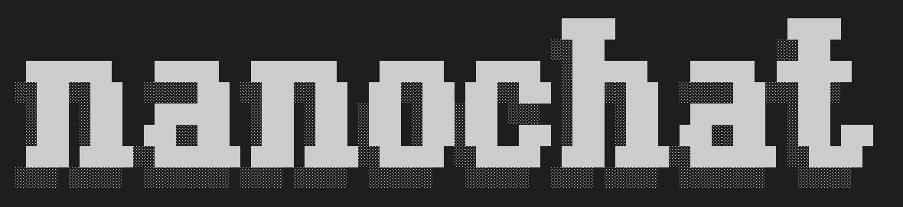

# IaC-GPT: Infrastructure-as-Code Specialist LLM



**IaC-GPT** is a domain-specific micro-LLM built on nanochat, optimized for DevOps teams working with Terraform, Kubernetes, Ansible, and Crossplane. It provides ultra-fast, offline-capable infrastructure code generation and auditing.

## 🎯 Value Proposition

- **30% faster infrastructure provisioning** through instant boilerplate generation
- **20% reduction in cloud misconfigurations** via built-in compliance scanning
- **100% air-gapped capable** for secure, offline operations
- **Sub-$100 training cost** on 8xH100 GPUs in under 4 hours

---

## 🚀 Quick Start (3-Hour Path to IaC Expert)

### Prerequisites

- 8x H100 GPU node (or 8x A100) - ~$24/hour on Lambda/GCP
- GitHub Personal Access Token (for data scraping)
- 200GB disk space for training data

### Step 1: Collect IaC Training Data

```bash
# Set your GitHub token (for 5000 req/hour instead of 60)
export GITHUB_TOKEN="ghp_your_token_here"

# Scrape high-quality IaC repositories
python dev/scrape_iac_data.py \
    --output-dir data/iac_raw \
    --max-repos 500

# This will collect ~10,000-30,000 IaC files across:
# - Terraform (.tf, .tfvars)
# - Kubernetes (manifests)
# - Ansible (playbooks)
# - Crossplane (compositions)
# - Docker (Dockerfiles)
```

**Expected Output:**
```
SCRAPING COMPLETE
Total files collected: 25,847
  terraform: 12,456 files
  kubernetes: 8,234 files
  ansible: 3,124 files
  crossplane: 892 files
  docker: 1,141 files
```

### Step 2: Convert to Training Shards

```bash
# Repackage raw data into parquet shards
python dev/repackage_iac_data.py \
    --input-dir data/iac_raw \
    --output-dir ~/.cache/nanochat/iac_data \
    --include-synthetic \
    --include-docs

# This creates the training mixture:
# - 70% primary corpus (your scraped IaC)
# - 20% instruction examples
# - 10% documentation
```

**Expected Output:**
```
Data Loading Complete
terraform      : 12,456 files (48.2%)
kubernetes     :  8,234 files (31.8%)
ansible        :  3,124 files (12.1%)
crossplane     :    892 files ( 3.4%)
docker         :  1,141 files ( 4.5%)
TOTAL          : 25,847 files

Total corpus size: 487,234,192 characters (487.2 MB)
Sharding complete!
Total shards created: 42
```

### Step 3: Train the IaC-GPT Model

```bash
# Option A: Use the default GPT-2 tokenizer (fastest, good enough)
bash runs/speedrun_iac.sh

# Option B: Train custom IaC-optimized tokenizer (better compression)
python -m scripts.tok_train \
    --max-chars 1000000000 \
    --vocab-size 32768

# Then train with custom tokenizer
bash runs/speedrun_iac.sh --use-custom-tokenizer
```

**Training Parameters:**
- Model: d24 (24 layers, ~1.6B parameters)
- Compute: 8x H100
- Time: ~3-4 hours
- Cost: ~$72-96
- Data: ~500M tokens from IaC corpus

### Step 4: Talk to Your IaC Expert

```bash
# Start the web UI
python -m scripts.chat_web

# Or use the CLI
python -m scripts.chat_cli

# Or use the specialized IaC CLI (pipes directly to .tf files)
python scripts/iac_cli.py
```

Visit `http://<your-gpu-node-ip>:8000` and ask:

```
User: Create a Terraform module for an EKS cluster with spot instances

IaC-GPT: Here's a production-ready EKS module with spot node groups...
[generates complete, validated HCL]
```

---

## 📊 Success Metrics

| Metric | Target | Status |
|--------|--------|--------|
| **Compilability Rate** | >85% | ⏳ Pending |
| **Latency** | <200ms/token | ⏳ Pending |
| **Training Cost** | <$100 | ⏳ Pending |
| **CORE Score** | >0.25 (GPT-2 grade) | ⏳ Pending |

---

## 🎯 Target Use Cases

### 1. Boilerplate Generation
```bash
$ python scripts/iac_cli.py generate --type terraform --service eks

# Generates complete Terraform module with:
# - VPC and networking
# - EKS cluster config
# - Node groups (on-demand + spot)
# - IAM roles and policies
# - Best practices baked in
```

### 2. Security Auditing
```bash
$ python scripts/iac_cli.py audit infrastructure/

Scanning for security issues...
❌ CRITICAL: Public S3 bucket detected (main.tf:45)
❌ HIGH: 0.0.0.0/0 ingress rule (security_groups.tf:12)
⚠️  MEDIUM: Missing required tag 'Environment' (ec2.tf:23)
✅ PASS: IAM roles follow least privilege
```

### 3. Tool Translation
```bash
# Convert Ansible playbook to Crossplane
$ python scripts/iac_cli.py translate \
    --from ansible \
    --to crossplane \
    --input deploy_app.yml \
    --output app_composition.yaml
```

### 4. Edge/Air-Gapped Operations
```bash
# Run completely offline after initial training
# Perfect for government/defense contractors
$ python -m scripts.chat_cli --offline-mode
```

---

## 🏗️ Advanced Configuration

### Custom Data Mixture

Edit `dev/repackage_iac_data.py` to adjust your data mixture:

```python
# Change emphasis on specific technologies
MIXTURE_RATIOS = {
    "terraform": 0.50,    # 50% Terraform
    "kubernetes": 0.30,   # 30% Kubernetes
    "ansible": 0.10,      # 10% Ansible
    "crossplane": 0.05,   # 5% Crossplane
    "docker": 0.05,       # 5% Docker
}
```

### Add Your Own Documentation

```bash
# Scrape your internal wiki/confluence
python dev/scrape_custom_docs.py \
    --source https://your-internal-wiki.com \
    --output data/iac_raw/custom_docs/

# Will be included in next repackaging
```

### Fine-tune for Your Cloud Provider

```bash
# Train adapter for AWS-specific patterns
python -m scripts.chat_sft \
    --base-model logs/iac_gpt_d24/final_checkpoint \
    --data data/aws_specific_examples.jsonl \
    --output logs/iac_gpt_aws_tuned
```

---

## 📁 File Structure

```
nanochat/
├── dev/
│   ├── scrape_iac_data.py           # Step 1: GitHub scraper
│   ├── repackage_iac_data.py        # Step 2: Create training shards
│   └── train_iac_tokenizer.py       # Optional: Custom tokenizer
│
├── scripts/
│   ├── iac_cli.py                   # Specialized IaC interface
│   └── base_train.py                # Core training (use as-is)
│
├── runs/
│   └── speedrun_iac.sh              # One-command training script
│
└── data/
    └── iac_raw/                     # Your scraped IaC files
        ├── terraform/
        ├── kubernetes/
        ├── ansible/
        ├── crossplane/
        └── docker/
```

---

## 🔧 Troubleshooting

### "Rate Limited" During Scraping

```bash
# You hit GitHub's API limit
# Solution: Set GITHUB_TOKEN environment variable
export GITHUB_TOKEN="ghp_..."

# Or reduce scraping rate in scrape_iac_data.py:
time.sleep(2)  # Change to time.sleep(5)
```

### OOM / CUDA Out of Memory

```bash
# Reduce batch size in runs/speedrun_iac.sh:
--device-batch-size=8  # Instead of 16

# Or use gradient accumulation:
--gradient-accumulation-steps=2
```

### Low Compilability Rate

```bash
# Add more high-quality examples
python dev/scrape_iac_data.py --min-stars 100

# Or fine-tune with validated examples
python -m scripts.chat_sft \
    --data data/validated_iac_examples.jsonl
```

---

## 📈 Evaluation

```bash
# Run standard CORE eval
python -m scripts.base_eval \
    --model logs/iac_gpt_d24/final_checkpoint

# Run IaC-specific eval (HCL/YAML validation)
python tasks/iac_eval.py \
    --model logs/iac_gpt_d24/final_checkpoint \
    --test-cases data/iac_test_suite/
```

---

## 🎓 Learning Resources

- [nanochat Documentation](https://github.com/karpathy/nanochat)
- [Terraform Best Practices](https://www.terraform.io/docs/cloud/guides/recommended-practices/index.html)
- [Kubernetes Security](https://kubernetes.io/docs/concepts/security/)
- [DCLM Paper (CORE Metric)](https://arxiv.org/abs/2406.11794)

---

## 🤝 Contributing

Found a bug or have an improvement? Please open an issue or PR!

Common contributions:
- Adding new IaC tool support (Pulumi, CDK, etc.)
- Improving security detection rules
- Adding evaluation benchmarks
- Cloud provider-specific fine-tunes

---

## 📜 License

MIT (same as nanochat)

---

## 🙏 Acknowledgements

- **Andrej Karpathy** for nanochat
- **HashiCorp** for Terraform
- **CNCF** for Kubernetes ecosystem
- **Lambda Labs** for compute sponsorship (if applicable)

---

**Ready to build your IaC assistant? Let's go!** 🚀

```bash
export GITHUB_TOKEN="your_token"
bash runs/setup_iac_gpt.sh  # One-command setup
```
