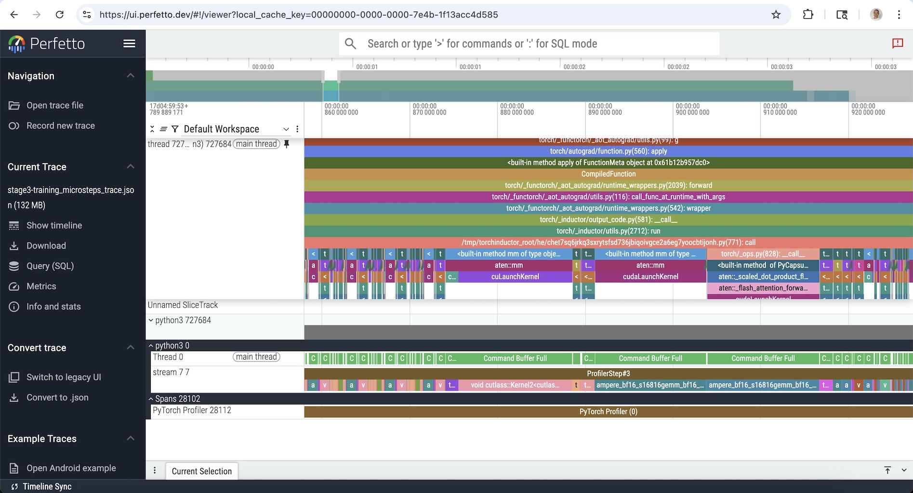
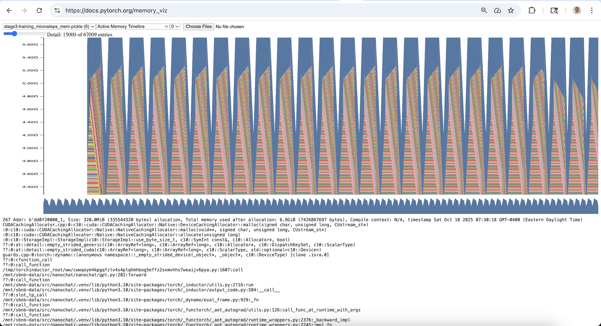

# Profiling Guide for Nanochat Training

## Overview

The profiling system supports two types of profiling:
1. **PyTorch Profiler** - Captures detailed CPU/CUDA activity traces and memory timelines
2. **CUDA Memory Snapshot** - Captures detailed memory allocation/deallocation events

## Quick Start

To enable profiling, add `--enable_profiling=True` to the `scripts.base_train` command in `speedrun.sh` e.g.:

```bash
torchrun --standalone --nproc_per_node=$NUM_GPU scripts.base_train --enable_profiling=True
```

This enables both PyTorch profiler and CUDA memory profiling for all phases. Look for cyan-colored `[PROFILER:phase_name]` messages in the output to track profiling progress.

## Output Files

Profiling outputs are saved to `<base_dir>/profile_traces/<timestamp>/` where each run gets its own timestamped subdirectory to avoid overwriting previous profiles (e.g. `~/.cache/nanochat/profile_traces/20250117_143022/`).

### PyTorch Profiler Outputs
- `{stage}-{phase_name}_trace.json` - Chrome trace file (viewable in chrome://tracing or https://ui.perfetto.dev/)
- `{stage}-{phase_name}_memory_timeline.html` - Memory timeline visualization

### CUDA Memory Snapshot Outputs
- `{stage}-{phase_name}_mem.pickle` - Memory snapshot (can be analyzed by visiting https://docs.pytorch.org/memory_viz)

**Stage prefixes**: Files are prefixed with `stage1-`, `stage2-`, `stage3-`, `stage4-` to indicate the order of profiling phases:
- `stage1-` = model_init (model creation, weight init, compilation)
- `stage2-` = eval_bpb (first validation evaluation)
- `stage3-` = training_microsteps (training micro-steps)
- `stage4-` = optimizer_step (gradient clipping, learning rate scheduling, optimizer step, zero_grad)

### Example Output Files

Typical profiling run generates the following files (sizes may vary based on model size and profiling duration):

```bash
$ cd ~/.cache/nanochat/profile_traces/20251018_111748
$ du -hs *
100K    stage1-model_init_mem.pickle
56K     stage1-model_init_memory_timeline.html
64M     stage1-model_init_trace.json
53M     stage2-eval_bpb_mem.pickle
52K     stage2-eval_bpb_memory_timeline.html
73M     stage2-eval_bpb_trace.json
43M     stage3-training_microsteps_mem.pickle
236K    stage3-training_microsteps_memory_timeline.html
126M    stage3-training_microsteps_trace.json
1.2M    stage4-optimizer_step_mem.pickle
76K     stage4-optimizer_step_memory_timeline.html
369M    stage4-optimizer_step_trace.json
```

**Total**: ~728 MB for a complete profiling run with all phases enabled.

## Viewing Profiling Results

### Chrome Traces
1. Open a web browser and visit https://ui.perfetto.dev/
2. Click "Open trace file" and select a `*_trace.json` file
3. Explore the timeline view with zoom and pan



*Nanochat profiling results: Training microsteps trace showing CPU/CUDA activity timeline down to individual CUDA kernel calls*

### Memory Timelines
1. Open the `*_memory_timeline.html` file in a web browser
2. Explore memory allocation patterns over time


*Nanochat profiling results: Memory timeline visualization showing allocation patterns across training micro-steps*

### CUDA Memory Snapshots
1. Visit https://pytorch.org/memory_viz in a web browser
2. Upload the `*_mem.pickle` file to analyze memory patterns



*Nanochat profiling results: CUDA memory snapshot showing detailed memory allocations by category*
