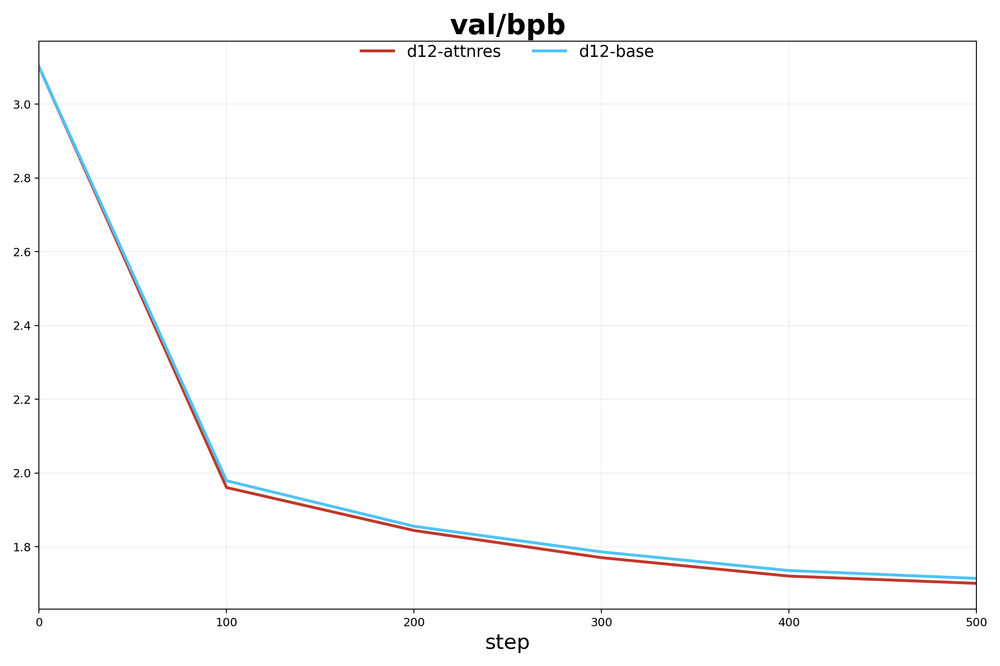
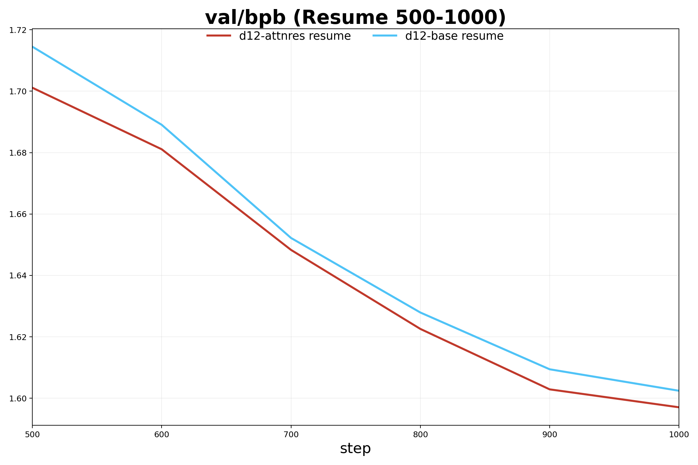

# Attention Residuals local d12 results

This change adds a gated AttnRes path on top of the current nanochat residual path instead of replacing it.

Key model change:
- Baseline path stays `base = resid_lambdas[i] * x + x0_lambdas[i] * x0`
- AttnRes path uses the same `base`, then applies a zero-init correction `base + alpha * (depth - base)`
- `alpha` starts at `0`, so AttnRes is exactly equal to baseline at initialization

Local experiment setup:
- `depth=12`
- `aspect_ratio=32`
- `head_dim=64`
- `max_seq_len=256`
- `device_batch_size=16`
- `total_batch_size=4096`
- `device_type=mps`
- `window_pattern=L`

## 0-500 steps

Checkpoint values:
- `100`: base `1.979283`, attnres `1.960904`
- `200`: base `1.855803`, attnres `1.844442`
- `300`: base `1.786364`, attnres `1.770760`
- `400`: base `1.735797`, attnres `1.720742`
- `500`: base `1.714498`, attnres `1.701136`

## 500-1000 steps

This figure is a checkpoint continuation from step `500` to step `1000`. It is not identical to a fresh `0-1000` run planned from the start, because the training horizon was extended at resume time.

Checkpoint values:
- `600`: base `1.689065`, attnres `1.681095`
- `700`: base `1.652204`, attnres `1.648315`
- `800`: base `1.627924`, attnres `1.622582`
- `900`: base `1.609432`, attnres `1.602892`
- `1000`: base `1.602437`, attnres `1.597053`
