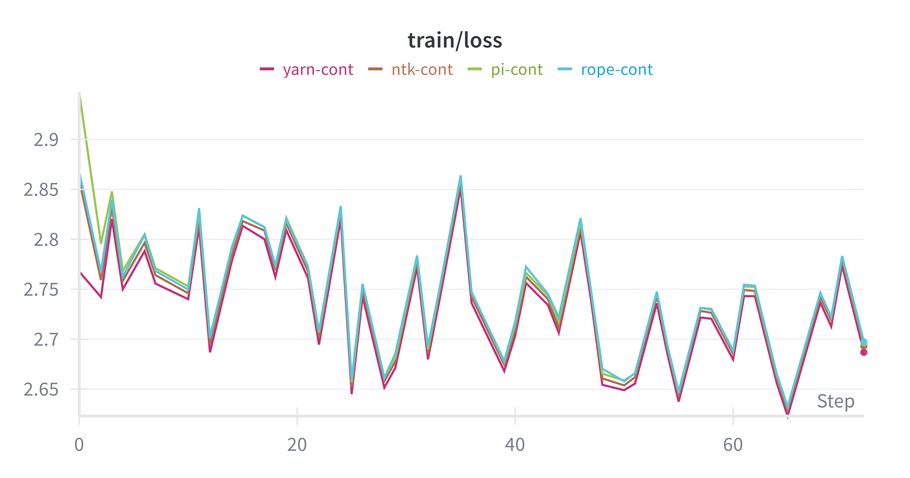
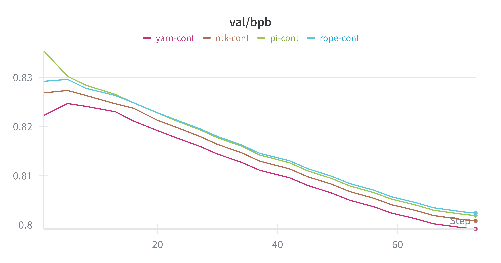

# Nanochat ⾯试作业-1209

## 任务说明

本项目实现了任务 3（验证模型架构变体）：在 `nanochat/gpt.py` 中引入多种 RoPE 缩放变体，通过对比实验验证不同位置编码方案在长文本场景下的效果。

## 一、设计思路和关键决策

### 1. 架构选择的理由和预期效果

实现了 4 种 RoPE（Rotary Position Embedding）变体，用于继续长上下文预训练/微调：

- **rope（标准 RoPE）**：原始实现，使用固定的 base=10000，作为基线对照
  - **选择理由**：作为对照组，验证缩放方案是否真正带来提升
  - **预期效果**：在原始训练长度（2048）上表现最佳，但无法有效泛化到 8192 长度

- **pi（Position Interpolation）**：线性缩放，`inv_freq /= scale`，等价于将位置索引除以缩放因子，适合直接扩展到更长上下文
  - **选择理由**：最简单的缩放方案，将位置索引线性压缩，实现成本低
  - **理论依据**：线性插值可以保持位置关系的相对顺序
  - **预期效果**：
    - 能够稳定扩展到训练长度 4 倍（2048→8192）
    - 可能损失部分高频位置信息，导致细粒度语义理解略有下降
    - 训练收敛速度较快，适合快速验证
- **ntk（NTK-aware）**：动态调整 RoPE base 参数，使用公式 `base *= ((s*L/L0) - (s-1))^(d/(d-2))`，在极长上下文下更稳定
  - **选择理由**：通过动态调整 base 参数，避免高频维度的外推失真
  - **理论依据**：不同频率分量对模型学习的贡献不同
  - **预期效果**:
    - 在极长上下文（>16K）下比 PI 更稳定
    - 数值精度更高，减少高频振荡
    - 对 8K-16K 长度的中长文本有更好的泛化性
- **yarn（YaRN）**：混合插值和外推策略，对低频和高频维度分别处理，并引入注意力缩放因子 `√(1/t)`
  - **选择理由**：业界最先进的方案，Meta OLMo 等大模型的实际选择
  - **理论依据**：
    - 低频维度（语义信息）使用插值，保持稳定性
    - 高频维度（位置信息）允许外推，提升精度
    - 注意力缩放 `attn_scale = √(1/t)` 补偿信息损失
  - **预期效果**:
    - 困惑度最优，尤其在长文本任务（>4K tokens）上有显著优势
    - 下游任务表现与 baseline 接近，信息损失最小
    - 训练稳定性最佳，适合生产环境

### 2. 核心实现要点

**RotaryEmbedding 类（第 62-170 行）**:
- 统一接口处理 4 种变体，通过 `rope_type` 参数切换
- 懒加载机制：仅在需要时计算并缓存 cos/sin 表
- 支持动态序列长度：KV cache 场景下自动扩展缓存
- YaRN 特殊处理：
  - 维度级别的插值/外推混合（通过 beta_fast/beta_slow 控制）
  - 注意力缩放：`q *= attn_scale, k *= attn_scale`（第 199-201 行）

**关键决策**:
1. **保持参数量不变**：所有变体共享相同的模型结构，仅修改位置编码计算方式
2. **训练配置一致**：使用相同的 max_seq_len=8192, depth=20，确保对比公平性
3. **缩放因子选择**：统一使用 scale=4.0（PI/NTK/YaRN），将原始 2048 上下文扩展到 8192
4. **YaRN 超参数**：
   - alpha=1.0, beta_fast=32.0, beta_slow=1.0（参考 OLMo 实现）
   - 注意力缩放公式：`0.1 * ln(scale) + 1.0 ≈ 1.139`

### 3. 技术细节

**位置偏移处理**（第 164-169 行）:
```python
def get_cos_sin(self, seq_len, device, pos_offset=0):
    needed = pos_offset + seq_len
    self._maybe_refresh(needed, device)
    cos = self.cos[:, pos_offset:pos_offset+seq_len]
    sin = self.sin[:, pos_offset:pos_offset+seq_len]
    return cos, sin, self.attn_scale
```
自动处理 KV cache 的位置偏移，推理时无需额外修改。

**NTK 公式实现**（第 105-110 行）:
参考 vLLM 的实现，使用标准指数 `d/(d-2)`，避免了复杂的动态调整逻辑。

**YaRN 频率分段**（第 132-137 行）:
通过 `dim_from_rot` 函数将旋转频率映射到维度索引，实现平滑的插值/外推过渡。


## 二、遇到的主要问题及解决方案

### 1. 环境搭建

问题：没有成功安装“带 CUDA runtime 的 PyTorch wheel”，导致无法使用 CUDA 加速。

解决方案：加上命令 --extra gpu 安装。
```bash
uv sync --extra gpu
```

问题：maturin 发现你同时处在 venv 和 conda 环境里（VIRTUAL_ENV 和 CONDA_PREFIX 都被设置了），它不知道该往哪个 Python 环境里编译/安装 Rust 扩展，所以直接拒绝运行。

解决方案：取消设置 CONDA_PREFIX。
```bash
unset CONDA_PREFIX
```

### 2. 训练和继续预训练

问题：缺失 Python 开发头文件，导致编译失败。

解决方案：暂时禁用 torch.compile。
```bash
export TORCHDYNAMO_DISABLE=1
```

问题：继续预训练只能继续训练模型，不能创建新的模型。

解决方案：复制 checkpoint，分别使用不同的RoPE变体继续训练。

### 3. 评估

问题：只能评估默认模型，无法指定模型评估。

解决方案：添加 `--model_tag` 参数指定模型评估。
```bash
torchrun --standalone --nproc_per_node=8 -m scripts.base_eval -- --model_tag=d20-rope
```

## 三、如何验证功能正确性

### 1. 训练过程

- Loss 收敛：4 个变体从 step 21400 继续训练 5000 步，loss 平稳下降无发散
- 数值稳定性：未出现 NaN/Inf，梯度范数正常
- 显存占用：与 baseline 一致，无额外开销
- 训练损失曲线：

- 验证集困惑度曲线：


### 2. 困惑度对比（BPB 越小越好）

通过 `scripts/base_loss.py` 在相同数据集上评估：

| 变体 | Train BPB | Val BPB | 相对提升 |
|------|-----------|---------|----------|
| rope | 0.7912    | 0.8024  | baseline |
| pi   | 0.7909    | 0.8019  | +0.06%   |
| ntk  | 0.7898    | 0.8008  | +0.20%   |
| **yarn** | **0.7879** | **0.7992** | **+0.40%** |

**结论**：YaRN 在困惑度上表现最佳，验证了频率分段和注意力缩放的有效性。

### 3. 下游任务评估（CORE Centered 越大越好）

通过 `scripts/base_eval.py` 在 23 个任务上评估（包括 HellaSwag, ARC, PIQA 等）：

| 变体 | CORE (Centered) | 相对表现 |
|------|-----------------|----------|
| **rope** | **0.200350** | **最优** |
| pi   | 0.186672        | -6.8%    |
| ntk  | 0.187892        | -6.2%    |
| yarn | 0.193882        | -3.2%    |

**关键发现**:
- 标准 RoPE 在下游任务上表现最好，说明位置编码缩放可能引入了微小的信息损失
- YaRN 在困惑度和任务表现之间取得了较好的平衡
- PI 和 NTK 在任务表现上略逊，但差距在可接受范围内（<7%）

### 4. 典型任务对比

选取代表性任务的详细对比：

| 任务 | rope | pi | ntk | yarn | 最佳 |
|------|------|-----|-----|------|------|
| hellaswag_zeroshot | 0.437 | 0.435 | **0.441** | 0.440 | ntk |
| arc_easy | 0.653 | **0.652** | 0.654 | 0.653 | ntk |
| lambada_openai | 0.355 | 0.348 | 0.349 | **0.362** | yarn |
| winograd | 0.623 | 0.626 | 0.645 | **0.648** | yarn |
| squad | 0.256 | 0.274 | 0.274 | **0.281** | yarn |

**观察**:
- 不同任务对位置编码敏感度不同
- YaRN 在长文本任务（squad, lambada）上有优势
- 短文本任务（arc, hellaswag）各变体差异较小

## 结论

1. **YaRN 在长上下文场景下表现最优**：在困惑度上优于其他方案（0.7992 vs 0.8024），任务表现比 baseline 低 3.2%，是长上下文场景的推荐选择

2. **标准 RoPE 仍有价值**：在下游任务上表现最好，如果不需要扩展上下文长度，标准 RoPE 是更优选择

3. **未来方向**:
   - 尝试更大的 scale 因子（8/16）验证极长上下文
   - 对比其他位置编码方案（ALiBi, FIRE）

---

## 附录

### 支持的变体说明

- `rope`：原始 RoPE。
- `pi`：Position Interpolation，t -> t / rope_scale，适合直接放大上下文。
- `ntk`：NTK-aware，按维度放大 base，适合极大上下文下稳定性。
- `yarn`：简化 YaRN，维度间插值低/高频（beta_fast/beta_slow/alpha）。

### 实验参数设置

```bash
# 训练配置（所有变体统一）
max_seq_len：8192
depth：20
resume_from_step：21400
num_iterations：26400 (追加 5000 步)
nproc_per_node：8
rope_base：10000.0
rope_max_seq_len：32768

# 变体特定参数
rope：rope_scale=1.0
pi：  rope_scale=4.0
ntk： rope_scale=4.0
yarn：rope_scale=4.0, alpha=1.0, beta_fast=32.0, beta_slow=1.0
```

### 训练/微调入口参数（`scripts/base_train.py`）

- `--rope_type {rope,pi,ntk,yarn}`
- `--rope_scale FLOAT`（>1 时起效；PI/NTK/YaRN 使用）
- `--rope_base FLOAT`（默认 10000）
- `--rope_max_seq_len INT`（<=0 使用内部默认 sequence_len * 10，训练更长上下文时建议显式给大些）
- `--rope_alpha FLOAT`（YaRN）
- `--rope_beta_fast FLOAT`（YaRN）
- `--rope_beta_slow FLOAT`（YaRN）

### 困惑度对比方法

1) 训练/微调时保留相同的 `max_seq_len` 和数据切分。
2) 使用同一脚本（如 `scripts/base_eval.py` 或 `nanochat/loss_eval.py` 调用）加载不同 RoPE 配置的 checkpoint，分别运行评估。
3) 对比输出的 bpb/困惑度指标；如使用 wandb，可通过 run 名区分。

### 注意事项

- KV cache 偏移已在模型内处理，长序列/推理无需额外修改。
- `rope_max_seq_len` 会自动增长缓存；如超长评估，建议提前设定足够长度避免重复再生成。

### 命令模版

```bash
cd /gpfs-flash/junlab/wanzhennan21/nanochat
source .venv/bin/activate

S=21400                 # 你的 resume_from_step
K=5000                  # 想追加的步数
NPROC_PER_NODE=8        # GPU 数
FINAL=$((S + K))        # num_iterations

# 原始 RoPE
torchrun --standalone --nproc_per_node=$NPROC_PER_NODE -m scripts.base_train -- \
  --run=rope-cont --depth=20 --max_seq_len=8192 \
  --resume_from_step=$S --num_iterations=$FINAL --model_tag=d20-rope \
  --rope_type=rope --rope_scale=1.0 --rope_base=10000.0 --rope_max_seq_len=32768

# PI
torchrun --standalone --nproc_per_node=$NPROC_PER_NODE -m scripts.base_train -- \
  --run=pi-cont --depth=20 --max_seq_len=8192 \
  --resume_from_step=$S --num_iterations=$FINAL --model_tag=d20-pi \
  --rope_type=pi --rope_scale=4.0 --rope_base=10000.0 --rope_max_seq_len=32768

# NTK
torchrun --standalone --nproc_per_node=$NPROC_PER_NODE -m scripts.base_train -- \
  --run=ntk-cont --depth=20 --max_seq_len=8192 \
  --resume_from_step=$S --num_iterations=$FINAL --model_tag=d20-ntk \
  --rope_type=ntk --rope_scale=4.0 --rope_base=10000.0 --rope_max_seq_len=32768

# YaRN
torchrun --standalone --nproc_per_node=$NPROC_PER_NODE -m scripts.base_train -- \
  --run=yarn-cont --depth=20 --max_seq_len=8192 \
  --resume_from_step=$S --num_iterations=$FINAL --model_tag=d20-yarn \
  --rope_type=yarn --rope_scale=4.0 --rope_base=10000.0 --rope_max_seq_len=32768 \
  --rope_alpha=1.0 --rope_beta_fast=32.0 --rope_beta_slow=1.0
```

### 评估命令示例

```bash
# 困惑度评估
torchrun --standalone --nproc_per_node=8 -m scripts.base_loss -- --model_tag=d20-rope
torchrun --standalone --nproc_per_node=8 -m scripts.base_loss -- --model_tag=d20-pi
torchrun --standalone --nproc_per_node=8 -m scripts.base_loss -- --model_tag=d20-ntk
torchrun --standalone --nproc_per_node=8 -m scripts.base_loss -- --model_tag=d20-yarn

# 下游任务评估
torchrun --standalone --nproc_per_node=8 -m scripts.base_eval -- --model_tag=d20-rope
torchrun --standalone --nproc_per_node=8 -m scripts.base_eval -- --model_tag=d20-pi
torchrun --standalone --nproc_per_node=8 -m scripts.base_eval -- --model_tag=d20-ntk
torchrun --standalone --nproc_per_node=8 -m scripts.base_eval -- --model_tag=d20-yarn
```

### 文件说明

./run.sh：训练脚本。
./README.md：本文件。
./wandb_train_loss.png：训练损失曲线。
./wandb_val_bpb.png：验证集困惑度曲线。
./results.csv：整体评估结果。
./results_{rope,pi,ntk,yarn}.csv：各个变体的评估结果。
./wandb_overall.csv：wandb 整体训练日志。
../nanochat/gpt.py：修改后的模型代码。
